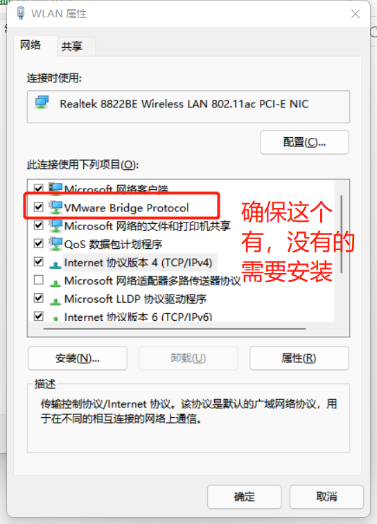
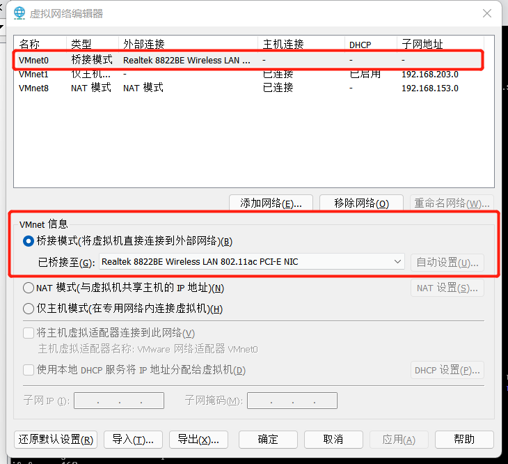

# CentOS8

## 网络配置

- #### 查看所有网卡

```shell
[root@centos8-51 ~]# cd /etc/sysconfig/network-scripts/
[root@centos8-51 network-scripts]# pwd
/etc/sysconfig/network-scripts
[root@centos8-51 network-scripts]# ls
ifcfg-ens160
```

- #### **修改网卡信息，这里修改ifcfg-ens160**

```shell
[root@centos8-51 network-scripts]# vi ifcfg-ens160 
TYPE=Ethernet
PROXY_METHOD=none
BROWSER_ONLY=no
BOOTPROTO=none
DEFROUTE=yes
IPV4_FAILURE_FATAL=no
IPV6INIT=yes
IPV6_AUTOCONF=yes
IPV6_DEFROUTE=yes
IPV6_FAILURE_FATAL=no
NAME=ens160
UUID=3b62bae9-0ede-48a0-ac63-af664980f5d6
DEVICE=ens160
ONBOOT=yes
IPADDR=192.168.0.51
PREFIX=24
NETMASK=255.255.255.0
GATEWAY=192.168.0.1
DNS1=192.168.0.1
IPV6_PRIVACY=no
```

| 属性名称 | 解释 |
| --- | --- |
| BOOTPROTO | 地址配置协议，可选none，dhcp，static。none就是static |
| NAME | 网卡名                                       |
| DEVICE | 设备名，通常与网卡名一样                     |
| ONBOOT | 开机是否自动启动，即开机就会启动此网络服务   |
| IPADDR | ip地址，需要与主机所连接网络的ip在同一个网段 |
| PREFIX | 子网掩码的数字表示 |
| NETMASK | 子网掩码，需要与主机所连接网络的子网掩码一致 |
| GATEWAY | 网关，需要与主机所连接网络的网关一致 |
| DNS1 | DNS服务器，与主机所连接网络的DNS一致保险一些 |

- #### 如何查看本机所连接网络的信息

  ##### 1、图形化查看（windows11为例，其余一样，无线网的可以跳过此步）

  - 控制面板（右上角查看方式改为大图标）->网络和共享中心

    

  - 单击连接上的网络->属性

    

  - 选中IPv4，查看属性

    

    >WLAN无线网通常都是DHCP动态划分IP，所以这里不会有信息，以太网则会有

  ##### 2、win11图形化快捷查看WLAN等网络配置信息

  - 设置->网络 & Internet

    

    

    > 这里的信息还是不够完善，一般家庭子网掩码都是255.255.255.0，网关与DNS相同

  ##### 3、CMD查看

  - win11 win+x->终端，其余win+q->输入cmd

    

  ```shell
  PS C:\Users\Yeansir> ipconfig
  ```

  

### 1、桥接模式

- #### 修改VMware默认桥接模式的网卡信息

  - 编辑->虚拟网络编辑器

    

  - 单机更改设置

    

  - 选中VMnet0，改变桥接模式的网卡信息，与主机所连接网络的网卡信息对应（<a href="#2、win11图形化快捷查看WLAN等网络配置信息">查看网卡信息</a>）

    

- #### 修改虚拟机网卡为桥接模式

  - 虚拟机->设置

    

  - 单击网络适配器->选中桥接模式

    

    > ==复制物理网络连接状态==的意思是说将虚拟网卡转换为真实的主机网卡，即主机连接网络后，虚拟机也会对应网卡信息获取连接。
    >
    > 此选项在修改VMnet0，即桥接模式下的网卡时，网卡信息选择若为自动，则必须勾选，意思就是会在主机连接网络后，为此虚拟机也自动连接上网络。个人理解是==先有此选项监听主机连接信息==再有自动匹配网卡
    >
    > 而上面我们指定了网卡信息，则不需要勾选（勾选了也不影响）

- #### 测试

  - ping局域网内主机，如自己本机

    ```shell
    [root@centos8-51 ~]# ping 192.168.0.110
    PING 192.168.0.110 (192.168.0.110) 56(84) bytes of data.
    64 bytes from 192.168.0.110: icmp_seq=1 ttl=128 time=0.373 ms
    64 bytes from 192.168.0.110: icmp_seq=2 ttl=128 time=0.206 ms
    64 bytes from 192.168.0.110: icmp_seq=3 ttl=128 time=0.235 ms
    64 bytes from 192.168.0.110: icmp_seq=4 ttl=128 time=0.241 ms
    64 bytes from 192.168.0.110: icmp_seq=5 ttl=128 time=0.213 ms
    ^C
    --- 192.168.0.110 ping statistics ---
    5 packets transmitted, 5 received, 0% packet loss, time 4110ms
    rtt min/avg/max/mdev = 0.206/0.253/0.373/0.063 ms
    [root@centos8-51 ~]# 
    ```

    > 不通的话，则ip就错啦，好好看看ip和子网掩码的信息吧

  - ping一个公网地址，如www.baidu.com

    ```shell
    [root@centos8-51 ~]# ping www.baidu.com
    PING www.a.shifen.com (180.101.49.11) 56(84) bytes of data.
    64 bytes from 180.101.49.11 (180.101.49.11): icmp_seq=1 ttl=53 time=44.3 ms
    64 bytes from 180.101.49.11 (180.101.49.11): icmp_seq=2 ttl=53 time=99.6 ms
    64 bytes from 180.101.49.11 (180.101.49.11): icmp_seq=3 ttl=53 time=36.1 ms
    64 bytes from 180.101.49.11 (180.101.49.11): icmp_seq=4 ttl=53 time=7.88 ms
    ^C
    --- www.a.shifen.com ping statistics ---
    4 packets transmitted, 4 received, 0% packet loss, time 3026ms
    rtt min/avg/max/mdev = 7.884/46.960/99.588/33.251 ms
    ```

    > 不通的话，就是DNS配错啦，不要乱用8.8.8.8，跟主机网络的DNS相同才最保险！
    >
    > 阿里DNS：223.5.5.5
    >
    > 谷歌DNS：8.8.8.8
    >
    > 中国电信DNS：114.114.114.144

### 2、


- #### 网络常用命令

  - ifconfig，查看网卡信息

    1. ==临时==修改或增加网卡ip和子网掩码：ifconfig [网卡名称(:0/1)] ip地址 netmask 子网掩码。可见一个网卡可以有多个ip。

  - ip addr show，查看的网卡信息不会有如ens160:0，只有ens160，但会有多个inet

  - ip addr delete [ip] dev [网卡(:0/:1)]，删除网卡信息

  - CentOS 7中的systemctl restart NetworkManager或者service network restart，重启网络服务

    > 修改配置文件后需要重启才生效

  - CentOS 8中重启网络服务

    - nmcli connection reload
    - nmcli connection down [网卡名] && nmcli connection up [网卡名]

  - 防火墙命令

    - 整体操作
      1. systemctl status firewalld.service，查看firewalld状态
      2. systemctl stop firewalld，关闭防火墙
      3. systemctl start firewalld，开启防火墙
      4. systemctl reload firewalld，重启防火墙
      5. systemctl disable firewalld，开机不启动
      6. systemctl is-enabled firewalld.service，查看开机是否启动
      7. systemctl enable firewalld，开机自动启动

    - 针对端口

      1. firewall-cmd --list-ports，查看已打开的端口
      2. firewall-cmd --permanent --zone=public --add-port=8080/tcp，永久打开8080/tcp端口
      3. firewall-cmd --permanent --zone=public --remove-port=8080/tcp，永久关闭8080/tcp端口

      > 改变端口状态后需要重启防火墙

    

## 基本与常用命令

- #### type，查看命令是外部命令还是内部命令

  1. 外部命令：系统软件的命令，需要时从磁盘读入内存，执行效率略低
  2. 内部命令：系统启动时就调入内存，并常驻内存，执行效率高

  ```shell
  [root@centos8-51 ~]# type cat
  cat 是 /usr/bin/cat
  [root@centos8-51 ~]# type clear
  clear 已被录入哈希表 (/usr/bin/clear)
  [root@centos8-51 ~]# type pwd
  pwd 是 shell 内建
  ```

  > 这里==事先用过clear==。
  >
  > cat：未被使用过的外部命令。
  >
  > clear：使用过的外部命令。
  >
  > pwd：内部命令

- #### su - [用户名]，切换用户

  ```shell
  [root@centos8-51 ~]# adduser iimer
  [root@centos8-51 ~]# su - iimer
  [iimer@centos8-51 ~]$ exit
  注销
  [root@centos8-51 ~]# 
  ```

  > #和$的区别：前者为管理员账号，后者为普通用户
  >
  > -是为了跳出root，到对应的家目录，不然要手动切才能有权限。并且还有环境变量的切换，所以必须要加。

- #### ls (选项) (参数)，查看目录下的文件

  - 选项
    1. -a 查看全部，包括==.==开头的隐藏文件
    2. -l （简写为ll命令，ll是ls -l的别名）列表查看文件的信息，从前到后为：类型，权限，链接个数，文件所有者，所有者所在组名，文件大小（单位为字节），上次修改日期时间，文件名称
    3. -d 只查看当前目录或指定参数的目录，常与-l搭配来==单独查看==这个目录的信息。
    4. -S 文件大小排序显示，==从大到小==
    5. -h 文件大小达到K或者M则变化，与-S一起用，-S不起作用
  - 参数
    1. 目录

- #### pwd，查看当前所在目录

- #### alias [别名]=‘[完整命令]’，给长完整命令起别名

  - 给修改网卡配置文件该别名

    ```shell
    [root@centos8-51 network-scripts]# alias viens160='vi /etc/sysconfig/network-scripts/ifcfg-ens160'
    [root@centos8-51 network-scripts]# viens160
    ```

  > unalias [别名]，取消别名

  - 给当前用户设置永久别名

    ```shell
    [root@centos8-51 network-scripts]# vi /root/.bashrc
    
    # .bashrc
    
    # User specific aliases and functions
    
    alias rm='rm -i'
    alias cp='cp -i'
    alias mv='mv -i'
    
    # Source global definitions
    if [ -f /etc/bashrc ]; then
            . /etc/bashrc
    fi
    alias viens160='vi /etc/sysconfig/network-scripts/ifcfg-ens160'
    [root@centos8-51 network-scripts]# source /root/.bashrc
    ```

    > 在/root/.bashrc文件最后添加alias完整命令，source /root/.bashrc命令来重新加载初始化配置文件

  - 对全部用户设置永久别名

    ```shell
    [root@centos8-51 network-scripts]# vi /etc/bashrc
    
    # /etc/bashrc
    
    # System wide functions and aliases
    # Environment stuff goes in /etc/profile
    
    # It's NOT a good idea to change this file unless you know what you
    # are doing. It's much better to create a custom.sh shell script in
    # /etc/profile.d/ to make custom changes to your environment, as this
    # will prevent the need for merging in future updates.
    
    # Prevent doublesourcing
    if [ -z "$BASHRCSOURCED" ]; then
      BASHRCSOURCED="Y"
    
      # are we an interactive shell?
      if [ "$PS1" ]; then
    alias viens160='vi /etc/sysconfig/network-scripts/ifcfg-ens160'
    [root@centos8-51 network-scripts]# source /etc/bashrc
    ```

    >在/etc/bashrc文件最后添加alias完整命令，source /etc/bashrc命令来重新加载初始化配置文件

- #### cd [参数]，切换目录

  - 参数

    1. 目录

    > ~或者不输：回到家目录，/home/[普通用户名] 或者 /root
    >
    > ..：上一级目录
    >
    > .：当前目录
    >
    > -：切换前的目录

- #### history，查看历史命令，无论是否有效

  - 从存储的位置查看历史命令，==只有开机前的记录，当前记录需要重启才会进去==

    ```shell
    [root@centos8-51 ~]# vi /root/.bash_history
    ```

  - 清楚当前未存储的历史命令

    ```shell
    [root@centos8-51 ~]# history -c
    ```

  - ctrl+r快速查询所有历史命令，避免用上下来找很久之前的

    ```shell
    (reverse-i-search)`sys': alias viens160='vi /etc/sysconfig/network-scripts/ifcfg-ens160'
    ```

    > 其他常用快捷键：!$表示上一个命令的参数

- #### date '(参数)'

  - 参数
    1. +%Y-%m-%d %H:%M:%S，对应年月日，小时分钟秒，位置可自己调整
    2. +%F，相当于+%Y-%m-%d
    3. 特殊：date -d '+1 months' '+%F'，显示加一个月后的+%F效果，可自己调整各参数
  - 

- #### time [完整命令]

  - 作用：查看实际时间，用户态时间，内核态时间，用来参考调优

- #### man [命令]

  - 查看命令选项等帮助文档

    ```shell
    [root@centos8-51 ~]# man find
    ```

  >支持翻页，上下滚动，q键退出
  >
  >==另一种查看帮助手册==：-h或者--help查看帮助手册，有的不支持-h

- #### shutdown [选项] [参数]

  - 选项
    1. -h 关机
    2. -r 重启
    3. -c 取消之前的关机设置
  - 参数
    1. +10，10分钟后关机或重启
    2. 指定时间如10:10，在10点10分关机或重启
    3. now，立即关机或重启

- #### init [0-6]，涉及开机级别

  1. 0：关机
  2. 1：单用户模式，禁止远程登陆，root权限
  3. 2：多用户模式，没有NFS和网络
  4. 3：完整的多用户文本模式，有NFS和网络，登录后进入控制台命令行模式
  5. 4：系统保留模式，
  6. 5：图形化模式
  7. 6：重启

- #### which，查看命令的位置

- #### uname -r，查看内核版本

### 1、文件管理命令

- #### touch [文件名]，创建文件

  - 使用

    ```shell
    [root@centos8-51 /]# ls
    bin  boot  dev  etc  home  lib  lib64  media  mnt  opt  proc  root  run  sbin  srv  sys  tmp  usr  var
    [root@centos8-51 /]# touch 123
    [root@centos8-51 /]# ls
    123  bin  boot  dev  etc  home  lib  lib64  media  mnt  opt  proc  root  run  sbin  srv  sys  tmp  usr  var
    ```

    > 当存在该名字的文件，则只修改此文件的修改时间

  > 文件名可以多个，用空格隔开。
  >
  > {1..20}表示数字1-20，可在文件名的任意处添加

- #### vim [文件名]，修改文件内容，不存在则创建（简介）

- #### stat [文件名或目录名]，查看文件详细状态信息

  - 状态信息

    1. 大小
    2. 权限
    3. 最近访问时间:atime
    4. 最近更改时间:mtime
    5. 最近改动时间:ctime，属性修改时间，如权限，更改时间也会带动改动时间

    > find / -mtime -1，一天内修改过的文件

  - 使用

    ```shell
    [root@centos8-51 /]# stat 123
      文件：123
      大小：639       	块：8          IO 块：4096   普通文件
    设备：803h/2051d	Inode：1005780     硬链接：1
    权限：(0644/-rw-r--r--)  Uid：(    0/    root)   Gid：(    0/    root)
    环境：unconfined_u:object_r:etc_runtime_t:s0
    最近访问：2021-10-08 00:47:08.706321431 +0800
    最近更改：2021-10-08 00:47:08.706321431 +0800
    最近改动：2021-10-08 00:47:08.706321431 +0800
    创建时间：-
    [root@centos8-51 /]# chmod +x 123
    [root@centos8-51 /]# stat 123
      文件：123
      大小：639       	块：8          IO 块：4096   普通文件
    设备：803h/2051d	Inode：1005780     硬链接：1
    权限：(0755/-rwxr-xr-x)  Uid：(    0/    root)   Gid：(    0/    root)
    环境：unconfined_u:object_r:etc_runtime_t:s0
    最近访问：2021-10-08 00:47:08.706321431 +0800
    最近更改：2021-10-08 00:47:08.706321431 +0800
    最近改动：2021-10-08 00:50:04.445329772 +0800
    创建时间：-
    ```

- #### 简介输入重定向符号：>：覆盖 ，>>：追加

  - 使用

    ```shell
    [root@centos8-51 /]# touch 125
    [root@centos8-51 /]# cat 125
    [root@centos8-51 /]# echo aaa > 125
    [root@centos8-51 /]# cat 125
    aaa
    [root@centos8-51 /]# echo bbb > 125
    [root@centos8-51 /]# cat 125
    bbb
    [root@centos8-51 /]# echo aaa >> 125
    [root@centos8-51 /]# cat 125
    bbb
    aaa
    ```

- #### mkdir (选项) [目录名]，创建目录

  - 选项
    1. -p 在不存在的目录下创建目录，即创建多层不存在的目录

  > 目录名字可以多个，用空格隔开。

- #### rm (选项) [文件或目录名]，删除目录

  - 选项
    1. -f 强制删除，没有提示，否则会让选择是否删除
    2. -r 删除目录，递归删除，把目录下的文件和目录也删除

  > 常用rm -rf [目录名]
  >
  > ==rm -rf /*，不会删除.开头的。且不能用.+ * ，或.. +* ，必须为如.bash*==

- #### rmdir [目录名]，删除空目录

  > 不常用

- #### cp (选项) [源文件或者目录] [目标文件或目录]，复制文件或目录到指定位置

  - 选项
    1. -r 递归处理，将目录下的所有文件和目录一并复制

  > 复制目录时需要-r
  >
  > 可指定目标名

- #### mv [文件或目录名]，移动文件或目录

  > 会将目录和目录下的文件和目录一起移动，可指定目标名

- #### cat [文件名]，查看文件内容命令

  > 显示整个文件的内容

- #### more [文件名]，分页查看文件内容

  > 回车刷新一行，空格刷新一屏，q键退出

- #### less [文件名]，与more类似

  > pageup向上翻页和箭头↑向上一行（与more相比多出来的功能），pagedn向下翻页，enter下一行，空格下翻页，q退出
  >
  > /字符+enter，查询字符

- #### head (选项) [文件名]，查看文件前十行

  - 选项
    1. -n 加数字，如head -n 3表示只显示前三行

- #### 简介管道：|

  > 以左边的输入，右边的命令展示输出

- #### tail (选项) [文件名]，查看文件后十行

  - 选项
    1. -n 加数字，如head -n 3表示只显示后三行
    2. -f 动态显示

  > -f 常用于监视日志变化

- #### vim [文件名]，修改文件内容，不存在则创建（详解）
  - 正常模式（初始模式，命令行模式esc进入）

    1. i 切换到插入模式，o 进入下一行开始插入且为新增空行，O反之，A 光标到行尾
    2. x 删除相当于del，X 删除位正常删除
    3. u 撤回一次
    4. r 替换，先按r再按替换后的字符，替换光标处字符
    5. 0 光标到行首，$ 光标到行尾
    6. gg 光标到文档首行，G 光标到末行
    7. yy 复制，dd 剪切，p 粘贴（光标下一行插入）。数字+yy/dd 表示从光标所在行开始多行操作
    8. D 从光标处删除到行尾
    9. ZZ 保存并退出

  - 命令行模式（从正常模式进入）

    - 输入:

      1. :e! 恢复
      2. :q! 强制退出或为不保存退出
      3. :wq 保存退出
      4. :wq! 强制保存退出，如只读模式下修改保存，对文件拥有者有效
      5. :noh 取消高亮
      6. :!+命令 进入命令打印显示的窗口，任意键退出
      7. :1,3(单数字或者%) s/源字符串/目标字符串(/g(i)) 1-3行的第一个匹配的替换，/g是全部替换，/gi是不区分大小写。单数字为只替换那一行的，%表示全部行。
      8. :set nu 设置行号 nonu为取消行号。当前用户永久设置：echo 'set nu' > ~/.vimrc。所有用户则是/etc/vimrc

    - 输入/

      1. /字符串，查所有含字符串的并高亮显示
      2. /^字符串，查找所有以字符串开头的行
      3. /字符串$，查找所有以字符串结尾的行

      >n为下一个，N为上一个，需要到正常模式

    > esc回到正常模式，或删除完命令行的字符

  - 插入模式（正常模式进入，i、o）

  - 可视块模式（正常是ctrl+v进入）
    - 选中区域为光标路径+最后光标所在处
      1. 空格 往后增加一列
    - 选中后的操作
      1. d 删除选中的，并进入正常模式
      2. 大写的i 进入插入模式，此时编辑的对应的列会在回到正常模式时一起受影响
      3. r+字符 全部替换

  >vim + [文件名] 表示光标初始在最后一行
  >
  >vim +[n] [文件名] 表示光标初始在弟n行
  >
  >vim -O [文件名] [文件名] 左右对比vim，ctrl+ww 切换。-o为上下对比。
  >
  >diff [文件名] [文件名] 输出不同
  >
  >对比推荐操作：vimdiff -O [文件名] [文件名]  不同的高亮

- #### iconv -f gb2312 -t utf8 a [文件名] -o [目标文件名]，编码格式从gb2312变为utf8

  > 用于windows到linux的文本文件乱码问题

- #### unix2dos [文件名]，解决windows文件到linux中换行符不一样的问题

- 

### 2、用户管理

- #### 基本要点

  - 分为root用户和普通用户
  - 用户和用户组概念

- #### 配置文件

  - /etc/passwd，记录每个用户的基本属性，并所有用户可读。一行记录对应一个用户

    ```shell
    [root@centos8-51 ~]# vim /etc/passwd
    
      1 root:x:0:0:root:/root:/bin/bash
      2 bin:x:1:1:bin:/bin:/sbin/nologin
      3 daemon:x:2:2:daemon:/sbin:/sbin/nologin
      4 adm:x:3:4:adm:/var/adm:/sbin/nologin
      5 lp:x:4:7:lp:/var/spool/lpd:/sbin/nologin
      6 sync:x:5:0:sync:/sbin:/bin/sync
      7 shutdown:x:6:0:shutdown:/sbin:/sbin/shutdown
      8 halt:x:7:0:halt:/sbin:/sbin/halt
      9 mail:x:8:12:mail:/var/spool/mail:/sbin/nologin
     10 operator:x:11:0:operator:/root:/sbin/nologin
     11 games:x:12:100:games:/usr/games:/sbin/nologin
     12 ftp:x:14:50:FTP User:/var/ftp:/sbin/nologin
     13 nobody:x:65534:65534:Kernel Overflow User:/:/sbin/nologin
     14 dbus:x:81:81:System message bus:/:/sbin/nologin
     15 systemd-coredump:x:999:997:systemd Core Dumper:/:/sbin/nologin
    "/etc/passwd" 23L, 1120C
    ```

    > ==格式与含义：==用户名:密码占位符:UID:GID:用户描述:用户家目录:登录后使用的shell。
    >
    > 扩展：查看所有可能的shell，cat /etc/shells。下载zsh，使用zsh（敲zsh+enter就切换了）

  - /etc/group，用户组信息存放文件，组名不能重复。包括附加组信息

  - /etc/shadow，存放密码的位置，无任何权限。root可以强制读。

  - /etc/login.defs，默认邮箱地址，密码的各种默认时间信息

  - /etc/default/useradd，默认bash，家目录位置，初始组等信息

- #### useradd -d -u “UID" -g '初始组' -G "附加组' -s "登陆的shell” 用户

  - -d：-d用户主目录路径，可以指定用户家目录
  - -M：不创建用户的家目录
  - -g：设置用户初始组的名称或数字ID；该组必须是存在的；如果没有设置该选项，useradd会根据 /etc/login.defs 文件中的USERGROUPS_ENAB 环境变量进行设置。默认USERGROUPS_ENAB yes会用和用户名相同的名字创建群组，GID等于UID
  - -G：用户要加入的附加组列表；使用逗号分隔多个组，不要添加空格；如果不设置，用户仅仅加入初始组。（一个用户只允许有一个主组，可以有多个附属组）
  - -s：用户默认登录shell的路径；启动过程结束后，默认启动的登录shell在此处设定；请确保使用的shell已经安装，默认是Bash。有时候需要禁止某些用户执行登录动作，例如用来执行系统服务的用户

  >将shell 设置成/sbin/nologin 就可以禁止用户登录。
  - 使用

    - 添加用户iimer2

      ```shell
      [root@centos8-51 ~]# useradd iimer2
      [root@centos8-51 ~]# tail -1 /etc/passwd
      iimer2:x:1001:1001::/home/iimer2:/bin/bash
      [root@centos8-51 ~]# id iimer
      uid=1000(iimer) gid=1000(iimer) 组=1000(iimer)
      ```

      > ==id [用户名]，显示该用户的uid，gid==
      >
      > 可见第一个普通用户是1000，后面的自增。并且默认创建一个gid与uid相同的组

    - 创建指定uid的用户iimer3

      ```shell
      [root@centos8-51 ~]# useradd -u 1100 iimer3
      [root@centos8-51 ~]# id iimer3
      uid=1100(iimer3) gid=1100(iimer3) 组=1100(iimer3)
      [root@centos8-51 ~]# tail -1 /etc/passwd
      iimer3:x:1100:1100::/home/iimer3:/bin/bash
      [root@centos8-51 ~]# ls /home
      iimer  iimer2  iimer3
      [root@centos8-51 ~]# ls -a /home/iimer3/
      .  ..  .bash_logout  .bash_profile  .bashrc
      ```

    - 创建指定家目录的用户iimer4

      ```shell
      [root@centos8-51 ~]# useradd -d /opt/iimer4 iimer4
      [root@centos8-51 ~]# id iimer4
      uid=1101(iimer4) gid=1101(iimer4) 组=1101(iimer4)
      [root@centos8-51 ~]# ls -a /opt/iimer4
      .  ..  .bash_logout  .bash_profile  .bashrc
      ```

    - 创建主组为iimer的用户iimer5

      ```shell
      [root@centos8-51 ~]# useradd -g iimer iimer5
      [root@centos8-51 ~]# id iimer5
      uid=1102(iimer5) gid=1000(iimer) 组=1000(iimer)
      [root@centos8-51 ~]# ls /home
      iimer  iimer2  iimer3  iimer5
      ```

      > iimer4的家目录在/opt/iimer4，所以这里没有

    - 创建附加组为iimer，iimer2，root的iimer6

      ```shell
      [root@centos8-51 ~]# useradd -G iimer,iimer2,root iimer6
      [root@centos8-51 ~]# id iimer6
      uid=1103(iimer6) gid=1103(iimer6) 组=1103(iimer6),1000(iimer),1001(iimer2),0(root)
      ```

  > 可以通过该/etc/passwd中用户的uid，来让一个uid有多个用户，如改成0，0就是当成root了。但实质上只有一个用户，都是root。

- #### userdel (选项) [用户名]，删除用户

  - 选项
    1. -r 连带家目录和/var/mail下的对应目录都删除。否则不删除

- #### chage [选项] [参数] [用户名]，修改密码的时间信息

  - 选项
    1. -m：密码可更改的最小天数。为0时代表任何时候都可以更改密码
    2. -M：密码保持有效的最大天数
    3. -W：用户密码到期前，提前收到警告信息的天数
    4. -E：帐号到期的日期。过了这天，此帐号将不可用
    5. -d：上一次更改的日期，==为0表示强制在下次登录时更新密码==

  > 可以直接修改shadow文件

- #### passwd [用户名]，修改密码

- #### 查看用户相关命令

  - id [用户名]，用户和组的信息
  - whoami，查看当前有效用户名
  - who，显示目前登入系统的用户信息
  - w，用于显示已经登陆系统的用户列表
  - users，用于显示当前登录系统的所有用户的用户列表

- #### usermod [选项] [参数] [用户名]，修改用户信息

  - -u UID
  - -d 宿主目录
  - -g 起始组，只能有一个
  - -G 附加组，可以多
  - -S 登录shell
  - -L 锁定
  - -c 描述信息

  > 也可以直接修改/etc/passwd来修改信息

- #### root密码忘了，如何恢复

  - 启动时选中第一个，按下'e'

    

  - quiet 后面添加rd.break，打断后面初始化操作

    

  - ctrl+x，开始加载内核，然后进入紧急模式

  - mount，发现/sysroot权限只读，需要更改为读写

    

    

  - chroot切换到/sysroot为根，修改语言为英文LANG=en，passwd修改密码，如果开了selinux，需要touch / .autorelabel否则重启后不会更新系统信息，再exit退出最后reboot。

  > CentOS 7的类似，编辑模式下找initrd就行

### 3、文件的权限管理

- #### 权限格式

  - 1位文件类型
    1. p，表示命名通道文件
    2. d，表示符号链接文件
    3. -，表示普通文件
    4. s，表示socket套接字文件，如mysql.sock
    5. c，表示字符设备文件，如tty1
    6. b，表示块设备文件，如sda，cdrom
  - 3位拥有者权限
    - 文件权限说明
      1. r读，cat等
      2. ==w写，vim echo等==
      3. x执行，脚本
    - 目录权限说明
      1. r，看到目录里有什么
      2. ==w，在目录里面操作如建文件，删除，移动==
      3. x，cd
  - 3位所属组权限
  - 3位其他人的权限
  - 拥有者名
  - 所属组名
  - 最近修改时间
  - 文件名

  > 文件所有者在没有任何权限时，可以强行vim更改

- #### chown，更改文件的属主和属组

  - chown user:group filename，修改属主和属组
  - chown user filename，修改属主
  - chown :group filename，修改属组

  > -R 递归目录所有文件

- #### chmod [参数] [文件名]，更改文件权限

  - 参数
    - 格式1，==u/g/a== + ==+/-== + ==r/w/x==
    - 格式2：==u/g/a== + ===== + ==r-x==
    - 格式3：3个数字，如777。
    - u：拥有者，g：用户组，o：其他用户，a：前三者都修改
    - +：添加权限，-：去除权限
    - r：4（100），w：2（010），x：1（001）

- #### 权限的默认值与umask机制

  - 默认值
    - 文件666
    - 目录777
  - umask 三位数字，设置umask
  - 机制：默认值与umask取反后的值做与运算。默认022

- #### 特殊权限

  - SUID

    - 限定：只能设置在可执行程序上即x，对目录设置无效

    - 功能：程序运行时的权限从执行者变成程序所有者的权限。

    - 格式：对chmod u+s或如4744

    - 举例1,passwd命令

      **查看passwd命令的权限**

      ```shell
      [root@centos8-51 /]# ll /usr/bin/passwd
      -rwsr-xr-x. 1 root root 33600 4月   7 2020 /usr/bin/passwd
      ```

      **切换到普通用户iimer，输入passwd**

      ```shell
      [root@centos8-51 /]# su - iimer
      [iimer@centos8-51 ~]$ passwd
      更改用户 iimer 的密码 。
      Current password: 
      ```

      **切换到另一个控制台查看运行passwd的进程信息，发现是root在运行，得到验证**

      ```shell
      [root@centos8-51 ~]# ps -axu | grep passwd
      root        2782  0.0  0.4 115260  8324 pts/1    S+   13:22   0:00 passwd
      root        2813  0.0  0.0  12348  1036 pts/0    S+   13:25   0:00 grep --color=auto passwd
      
      ```

    - 举例2，less命令

      **iimer用户试图用less查看/etc/shadow**

      ```shell
      [iimer@centos8-51 ~]$ less /etc/shadow
      /etc/shadow: 权限不够
      ```

      **root用户修改less命令的权限，加上SUID**

      ```shell
      [root@centos8-51 ~]# ll /usr/bin/less
      -rwxr-xr-x. 1 root root 192040 5月  11 2019 /usr/bin/less
      [root@centos8-51 ~]# chmod u+s /usr/bin/less
      ```

      **再次执行less 查看/etc/shadow就成功了**

  - SGID

    - 限定：多对目录设置，二进制可执行程序也可以设置
    - 功能：在这目录下创建的文件的属组是上一级目录的属组，且如果创建的是目录则也有此特权。即当前用户组失效。
    - 格式：g+s

    - 演示

      ```shel
      [root@centos8-51 /]# mkdir test
      [root@centos8-51 /]# ll -d test
      drwxr-xr-x. 2 root root 6 10月  8 13:40 test
      [root@centos8-51 /]# chown :iimer test
      [root@centos8-51 /]# chmod g+s test
      [root@centos8-51 /]# ll -d test
      drwxr-sr-x. 2 root iimer 6 10月  8 13:40 test
      [root@centos8-51 /]# cd test
      [root@centos8-51 test]# mkdir test1
      [root@centos8-51 test]# touch file1
      [root@centos8-51 test]# ll -d test1 file1
      -rw-r--r--. 1 root iimer 0 10月  8 13:42 file1
      drwxr-sr-x. 2 root iimer 6 10月  8 13:42 test1
      ```

  - Stickybit

    - 限定：目录
    - 功能：目录下创建的文件只有root、文件创建者、目录所有者才能有目录的w操作
    - o+t，/tmp下的就是

    > 只有自己或者root可以操作

- #### ACL扩展权限

  - getfacl [文件名或者目录名]，查看详细权限信息

  - setfacl 

    - -m [参数] [文件名或者目录名]，添加或修改权限
      1. -m u:user1:rwx [文件名或目录名]
      2. -m d:u:user1:rwx [目录名]，该目录下的文件也会默认有这个权限
    - -R -m [参数] [目录名]，现在的目录和下的所有文件都有此权限。格式同上。
    - -x u:user1 [文件名或目录名]，删除此添加
    - -b [文件名或目录名]，删除所有添加的

  - 使用

    **其余用户没有w权限，给iimer单独设置w权限，测试可不可以vim**

    ```shell
    [root@centos8-51 /]# getfacl filetest 
    # file: filetest
    # owner: root
    # group: root
    user::rw-
    group::r--
    other::r--
    
    [root@centos8-51 /]# setfacl -m u:iimer:rwx filetest 
    [root@centos8-51 /]# getfacl filetest 
    # file: filetest
    # owner: root
    # group: root
    user::rw-
    user:iimer:rwx
    group::r--
    mask::rwx
    other::r--
    
    [root@centos8-51 /]# su - iimer
    上一次登录：五 10月  8 13:48:08 CST 2021pts/1 上
    [iimer@centos8-51 ~]$ cd /
    [iimer@centos8-51 /]$ vim filetest
    ```

    > 有权限

- #### chattr [选项] [文件或目录名]，跳出圈子的权限设置

  - 选项
    1. +a：只能追加内容
    2. +i：不允许对这个文件修改。如果是目录则不允许在这个目录下创建和删除文件
    3. -i：去除i
    4. -a：去除a

- #### lsattr [文件或目录名]，查看设置的i或者a

### 4、软件包管理与常用环境安装和配置

- #### rpm包

  - 每个centos都有光盘自带的本地rpm源
  - 二进制包，即已经使用gcc编译过的，区分于tar 源码包
  - 格式：软件吗-主版本号-次版本号-修订.el+适用linux操作系统版本.适用的cpu等硬件信息（x86_64为常用64位PC机，i686为32位--64位机向下兼容--，noarch表示64和32位都可以--通常位文本文件如shell、html、txt--。uname -r查看内核版本）
  - 全名和软件名

- #### rpm -ivh/Uvh [参数]

  - 参数

    - 完整包名：安装和更新升级
    - 包名：查找或卸载，会默认到/var/lib/rpm下搜索

  - ivh/Uvh+完整包名

    1. -i 表示install
    2. -v 显示附加信息
    3. -h 安装时输出#####
    4. -U更新

  - 其余选项

    1. -q+包名，是否已安装或者配合==a==查看所有已安装的。
    2. -qf+文件名，配合==f==查询文件或命令属于哪个安装包
    3. -qpi+完整包名，查看未安装的rpm包的详细信息。不加p则是安装了的。
    4. -qpl+完整包名，查看安装后会生成哪些文件
    5. -ql+包名，查看安装后生成的哪些文件
    6. -Vf+文件名，查看是否修改过
    7. -V+包名，检查包安装的所有文件有没有被修改
    8. -Va不加参数，找到所有被修改过的文件。一般用==>==重定向到一个文件
    9. -e+包名，卸载。--nodeps表示忽略依赖。

  - --import +密钥，导入密钥

  - 使用

    - 查看一个命令是哪个软件包安装的

      ```shell
      [root@centos8-51 /]# which vi
      /usr/bin/vi
      [root@centos8-51 /]# rpm -qf /usr/bin/vi
      vim-minimal-8.0.1763-15.el8.x86_64
      [root@centos8-51 /]# which vim
      /usr/bin/vim
      [root@centos8-51 /]# rpm -qf /usr/bin/vim
      vim-enhanced-8.0.1763-15.el8.x86_64
      或者rpm -qf  `which vim`
      ```
      
      > 可见vim和vi的软件包是不一样的

  > rpm存在依赖问题，更新和卸载很麻烦，还是用yum好

- #### yum命令

  - 优势：能自动下载rpm包并安装

  - 本地公钥地址：/etc/pki/rpm-gpg

  - 扩展yum源，下载epel

    ```shell
    [root@centos8-51 /]# yum install epel-release
    ```

    > 多出一个公钥
    
  - 配置本地YUM源

    - yum的一切配置信息都存储在xxx.repo的配置文件中，位于/etc/yum.repos.d目录下。

    > centos 7 开始就不需要自己配置了，拥有全球的yum源。使用时ping全部的，用快的。
    >
    > 光盘也有自带的源，因为都不是最新的，且会优先到网络上的去搜索，这里不赘述

  - 适用==wget== down下来阿里yum源（其实也不需要）

    ```shell
    [root@centos8-51 /]# wget -0 /etc/yum.repos.d/Centos-ali-8.repo http://mirrors.aliyun.com/repo/Centos-8.repo
    [root@centos8-51 /]# vim /etc/yum.repos.d/Centos-ali-8.repo
    ```

  - 常用命令

    - yum update，内核和系统一起升级
    - yum upgrade，升级软件包，不改变软件设置和系统设置，系统版本升级，内核不升级
    - yum info rpm包名，查看包详细信息
    - yum provides 命令文件名，查看命令哪个软件包安装的
    - yum remove rpm包名，移除包名
    - yum search [参数]，查询包含这个名称的包名
    - yum grouplist，查看软件包组
    - yum groupinstall "软件包组名"，如Development tools，非图形化界面的系统安装这个可以省很多事
    - yum list installed mysql*，查看mysql开头的已经安装的包
    - yum list mysql*，查看安装和没安装的mysql开头的包
    - yum repolist enabled，查看启用了的所有repo
  
  > CentOS 8中的yum是dnf的软链接，但命令和源都是兼容保留的
  
- #### Mysql安装与配置

  - yum安装

    1. https://dev.mysql.com/downloads/repo/yum/获取下载链接

       

       

    2. 下载rpm包，并移动到自己习惯放rpm包的位置

       ```shell
       [root@centos8-51 ~]# wget -o https://dev.mysql.com/get/mysql80-community-release-el8-1.noarch.rpm
       [root@centos8-51 ~]# mv mysql80-community-release-el8-1.noarch.rpm /usr/local/my-rpm/
       [root@centos8-51 ~]# cd /usr/local/my-rpm/
       ```

    3. 安装rpm包。安装成功后，会多出mysql的yum的repo

       ```shell
       [root@centos8-51 my-rpm]# yum localinstall mysql80-community-release-el8-1.noarch.rpm
       ```

    4. 安装mysql

       ```shell
       [root@centos8-51 my-rpm]# yum install -y mysql-server
       ```

    5. 启动mysql并查看状态

       ```shell
       [root@centos8-51 my-rpm]# systemctl start mysqld
       [root@centos8-51 my-rpm]# systemctl status mysqld
       ● mysqld.service - MySQL 8.0 database server
          Loaded: loaded (/usr/lib/systemd/system/mysqld.service; disabled; vendor preset: disabled)
          Active: active (running) since Wed 2021-10-13 05:15:46 CST; 7s ago
         Process: 56694 ExecStartPost=/usr/libexec/mysql-check-upgrade (code=exited, status=0/SUCCESS)
         Process: 56562 ExecStartPre=/usr/libexec/mysql-prepare-db-dir mysqld.service (code=exited, st>
         Process: 56537 ExecStartPre=/usr/libexec/mysql-check-socket (code=exited, status=0/SUCCESS)
        Main PID: 56647 (mysqld)
          Status: "Server is operational"
           Tasks: 38 (limit: 12259)
          Memory: 448.0M
          CGroup: /system.slice/mysqld.service
                  └─56647 /usr/libexec/mysqld --basedir=/usr
       
       10月 13 05:15:40 centos8-51.cn systemd[1]: Starting MySQL 8.0 database server...
       10月 13 05:15:40 centos8-51.cn mysql-prepare-db-dir[56562]: Initializing MySQL database
       10月 13 05:15:46 centos8-51.cn systemd[1]: Started MySQL 8.0 database server.
       ```

    6. 设置开机启动

       ```shell
       [root@centos8-51 my-rpm]# systemctl enable mysqld
       ```

    7. 重要的目录介绍

       1. /var/lib/mysql/，数据库文件目录
       2. /etc/my.cnf，mysql配置文件
       3. /etc/my.cnf.d mysql的启动配置文件

    8. 免密登录root用户，修改密码

       ```mysql
       mysql> use mysql;
       Reading table information for completion of table and column names
       You can turn off this feature to get a quicker startup with -A
       
       Database changed
       # 改变root密码为123456
       mysql> alter user 'root'@'localhost' identified by'123456';
       Query OK, 0 rows affected (0.01 sec)
       # root密码永不过期
       mysql> alter user 'root'@'localhost' password expire never;
       Query OK, 0 rows affected (0.00 sec)
       # 任何host都能用root账号登录
       mysql> update user set host='%' where user = 'root';
       Query OK, 1 row affected (0.01 sec)
       Rows matched: 1  Changed: 1  Warnings: 0
       
       mysql> flush privileges;
       Query OK, 0 rows affected (0.00 sec)
       ```

    9. 永久开放3306端口

       ```shell
       [root@centos8-51 ~]# firewall-cmd --permanent --zone=public --add-port=3306/tcp
       success
       [root@centos8-51 ~]# systemctl reload firewalld
       ```

       

- #### redis安装

  - http://download.redis.io/releases/ 查看版本号，wget下载压缩包

    ```shell
    #下载到自己喜欢的位置，我的是/usr/local/my-tar
    wget http://download.redis.io/releases/redis-6.0.5.tar.gz
    ```

  - 解压，编译，安装并指定存放可执行程序的位置

    ```shell
    tar -zxvf redis-6.0.5.tar.gz
    make
    make install PREFIX=/opt/redis6
    ```

  - 移动解压后的文件夹下的redis.conf到喜欢的位置，我的是/etc/redis.conf。修改一些配置

    ```shell
    cp /usr/local/redis-6.0.5/redis.conf /etc/redis.conf
    logfile "/var/log/redis/6379.log"　　　　　　# 配置日志文件存放的地方
    dir 　　/var/lib/redis/6379　　　　　　　　　　# 配置数据存放的路径
    daemonize   yes　　　　　　　　　　　　　　　　 # 以守护进程启动
    ```

    > 必须要事先创建好对应的目录，否则会启动报错

  - 拷贝一份redis服务到/lib/systemd/system/下，以便使用systemctl命令。并修改一些配置

    ```shell
    cp /usr/local/redis-6.0.5/utils/systemd-redis_server.service /lib/systemd/system/redis_6379.service
    
     18 [Unit]
     19 Description=redis_6379
     20 Documentation=https://redis.io/documentation
     21 #Before=your_application.service another_example_application.service
     22 #AssertPathExists=/var/lib/redis
     23 
     24 [Service]
     25 Type=forking
     26 PIDFile=/var/run/redis_6379.pid
     27 ExecStart=/opt/redis6/bin/redis-server /etc/redis.conf
     28 ExecReload=/bin/kill -s HUP $MAINPID
     29 ExecStop=/bin/kill -s QUIT $MAINPID
     30 ## Alternatively, have redis-server load a configuration file:
     31 #ExecStart=/usr/local/bin/redis-server /path/to/your/redis.conf
     32 #LimitNOFILE=10032
     33 #NoNewPrivileges=yes
     34 #OOMScoreAdjust=-900
     35 PrivateTmp=yes
     36 #Type=notify
     37 #TimeoutStartSec=infinity
     38 #TimeoutStopSec=infinity
     39 #UMask=0077
     40 #User=redis
     41 #Group=redis
     42 #WorkingDirectory=/var/lib/redis
     43 
     44 [Install]
     45 WantedBy=multi-user.target
    
    ```

  - 测试与将redis设置为开机启动

    ```shell
    systemctl start redis_6379
    systemctl status redis_6379
    systemctl stop redis_6379
    systemctl enable redis_6379
    ```

  - 永久开放6379端口

    ```shell
    firewall-cmd --permanent --zone=public --add-port=6379/tcp
    systemctl reload firewalld
    ```

  - 把redis-cli加入到bash中

    ```shell
    [root@centos8-51 ~]# cd /opt/redis6/bin
    [root@centos8-51 bin]# ls
    redis-benchmark  redis-check-aof  redis-check-rdb  redis-cli  redis-sentinel  redis-server
    [root@centos8-51 bin]# ln redis-cli /usr/bin/redis
    [root@centos8-51 bin]# redis
    127.0.0.1:6379> ping
    PONG
    127.0.0.1:6379> exit
    [root@centos8-51 bin]# 
    ```

- rabbitmq安装

  - https://www.erlang-solutions.com/downloads/ 下载erlang-22.3.4.16-1.el8.x86_64.rpm

  - https://centos.pkgs.org/8/centos-appstream-x86_64/ 下载socat-1.7.3.3-2.el8.x86_64.rpm

  - https://mirrors.huaweicloud.com/rabbitmq-server/ 下载rabbitmq-server-3.8.4-1.el8.noarch.rpm

  - 安装

    ```shell
    yum install -y erlang-22.3.4.16-1.el8.x86_64.rpm
    yum install -y socat-1.7.3.3-2.el8.x86_64.rpm
    yum install -y rabbitmq-server-3.8.4-1.el8.noarch.rpm
    ```

  - 常用命令

    ```shell
    systemctl start rabbitmq-server #启动
    systemctl status rabbitmq-server #查看状态
    rabbitmq-plugins enable rabbitmq_management #启动插件页面管理
    ```

  - 添加用户并赋予权限

    ```shell
    rabbitmqctl add_user admin admin
    rabbitmqctl set_user_tags admin administrator
    rabbitmqctl set_permissions -p / admin ".*" ".*" ".*"
    ```

  - 永久开启15672端口

    ```shell
    firewall-cmd --permanent --zone=public --add-port=15672/tcp
    systemctl reload firewalld
    ```

  - 访问http://[自己的ip]:15672

    

### 5、进程管理

- #### Linux中的进程

  - 所有进程都是第一个系统进程的后代
    - centos6中PID为1的进程为：init
    - centos7、8中PID为1的进程为：systemd

- #### ps -axu，查看所有进程没有PPID（父进程号）

  - axu解析

    1. a：跟当前终端关联的所有进程
    2. x：所有终端
    3. u：基于用户的格式显示（U：针对某用户ID）

  - 包含的信息含义

    ```shell
    [root@centos8-51 /]# ps -axu
    USER         PID %CPU %MEM    VSZ   RSS TTY      STAT START   TIME COMMAND
    root           1  0.0  0.7 188412 15184 ?        Ss   00:14   0:04 /usr/lib/systemd/systemd --switched-root --system --deserialize 18
    root           2  0.0  0.0      0     0 ?        S    00:14   0:00 [kthreadd]
    
    ```

    1. USER：启动这些进程的用户

    2. PID：进程的ID

    3. %CPU：进程占用CPU百分比

    4. %MEM：占用内存的百分比

    5. VSZ：进程占用的虚拟内存大小，KB

    6. RSS：进程占用的物理内存大小，KB

    7. STAT：进程目前的状态，Linux进程有5种基本状态

       1. R：正在运行或就绪
       2. S：睡眠状态，可被signal唤醒
       3. T：正在侦测或者停止
       4. Z：僵尸进程
       5. D：不可中断状态，如打包

       > 其余状态：
       >
       > <：表示进程运行在高优先级上 
       >
       > N：表示进程运行在低优先级上 
       >
       > L：表示进程有页面锁定在内存中 
       >
       > s：表示进程是控制进程 
       >
       > I：表示进程是多线程的 
       >
       > +：表示当前进程运行在前台

    8. START：进程启动时间
    9. TIME：进程实际在CPU上运行的时间
    10. COMMAND：程序的实际指令，[]括起来的是内核态进程，别的是用户态进程

  - 特殊的
    - ctrl-c 发送SIGINT信号，终止进程
    - ctrl-z 发送SIGSTOP信号，挂起进程

- #### ps -ef，查看所有进程，有PPID

  - 包含的信息含义
    1. UID：启动进程的用户
    2. PID：进程的ID
    3. PPID：父进程的进程号
    4. C：CPU利用率
    5. STIME：进程启动的时间
    6. TTY：表示哪个终端设备上运行，？为内核态进程。pst/0等为网络连接主机的程序
    7. TIME：进程实际在CPU上运行的时间
    8. CMD：启动的程序名称，[]括起来的是内核态进程，别的是用户态进程

- #### uptime，查看系统负载

  - 使用

    ```shell
    uptime
     16:32:31 up 16:18,  3 users,  load average: 0.00, 0.15, 0.31
    ```

  - 各个含义

    | 显示信息                       | 解释                                                         |
    | ------------------------------ | ------------------------------------------------------------ |
    | 16:32:31                       | 当前时间                                                     |
    | up 16:18                       | 运行了16小时18分钟                                           |
    | 3 users                        | 登录的用户数，操作系统本身一个，我开了2个                    |
    | load average: 0.00, 0.15, 0.31 | 系统负载，即任务队列的平均长度。1分钟、5分钟、15分钟前到现在的平均值 |

    > 判断负载高不高，每个核心3为阈值

- #### top，动态查看详细负载情况

  

  - 信息详解

    - Tasks

      | 图中名称     | 含义             |
      | ------------ | ---------------- |
      | 226 total    | 进程总数         |
      | 2 running    | 正在运行的进程数 |
      | 224 sleeping | 睡眠的进程数     |
      | 0 stopped    | 停止的进程数     |
      | 0 zombie     | 僵尸进程数       |

    - %Cpu(s)

      | 图中名称 | 含义                                            |
      | -------- | ----------------------------------------------- |
      | 0.0 us   | 用户进程使用 CPU 百分比                         |
      | 0.1 sy   | 内核中的进程占用 CPU 百分比                     |
      | 0.0 ni   | 用户进程空间内改变过优先级的进程占用 CPU 百分比 |
      | 99.8 id  | 空闲 CPU 百分比                                 |
      | 0.0 wa   | cpu 等待 I/0 完成的时间总量百分比               |
      | 0.1 hi   | 硬中断消耗cpu时间百分比                         |
      | 0.0 si   | 软中断消耗cpu时间百分比                         |
      |          |                                                 |

      

    


## Linux系统底层与设计

### 1、目录

| 目录         | 说明                                                         |
| ------------ | ------------------------------------------------------------ |
| /            | linux文件系统的入口，所有目录、文件、设备都在 / 之下         |
| /bin         | Binary的缩写，类似于/usr/bin，常用的二进制命令目录，如ls、cp、mkdir、cut等 |
| /boot        | 存放系统启动相关的文件，如内核                               |
| /dev         | 存放设备文件，linux中一切皆文件，设备也是文件， 如/dev/sda,/dev/sda1,/dev/tty1,/dev/tty2 |
| /etc         | 存放系统和二进制安装包配置文件默认路径和服务器启动命令目录，如/etc/passwd 用户信息文件，/etc/shadow用户密码文件，/etc/group存储用户组信息，/etc/fstab 系统开机启动自动挂载分区列表，/etc/hosts用户主机名信息 |
| /home        | 普通用户的家目录存放路径                                     |
| /lib         | 存放库文件                                                   |
| /mnt，/media | 用来临时挂载存储设备的挂载目录，比如U盘目录                  |
| /opt         | 安装的某些软件包，如gitlab                                   |
| /proc        | 存放进程信息和内核信息，此目录为虚拟目录，存在于内存而不是磁盘，挂载的是伪装的文件系统proc，如查看CPU信息：cat /proc/cpuinfo。/proc下的数字为进程号 |
| /sys         | 系统目录，存放硬件信息                                       |
| /run         | 运行目录，存放的是系统运行时数据，比如进程的PID文件          |
| /srv         | 服务目录，存放本地服务的相关文件                             |
| /sbin        | 存放系统管理的命令，只有root用户可执行                       |
| /tmp         | 存放临时文件，会在某些时机自己删除，类似垃圾清理，只有owner和root可以主动删除 |
| /var         | 系统运行和软件运行时产生的日志信息等，/var/log               |
| /usr         | 存放应用程序和文件，/usr/bin普通用户使用的应用程序；/usr/sbin管理员使用的应用程序；/usr/lib库文件如Glibc（32位），/usr/lib64库文件Glibc |
| /lib，/lib64 | 是/usr/lib和/usr/lib64的软链接，存放系统最基本的动态链接共享库，包含许多被/bin和/sbin中的程序使用的库文件，目录/usr/lib/中含有更多用于用户程序的库文件，.a是静态库（编译时就加载到二进制文件中），.so是动态库（运行时加载到进程的内存空间中） |


## 常用包下载与使用

- #### tree

  - 下载

    ```shell
    [root@centos8-51 ~]# dnf install tree
    ```

  - 使用：以树的形式查看目录下所有文件

    ```shell
    [root@centos8-51 ~]# tree /etc
    ```

    


## shell

