# HTML&&CSS

## 自我答疑与总结

### 1、布局的理解

#### 1、布局的结构分为

1. 整体页面的部位，如header----->2、从中不断割裂相对大的功能模块直到足够小----->3、完善对应功能模块

#### 2、布局中的技巧

- 子盒子浮动定位的无宽高功能切割盒子的自适应

1. 功能模块定位好，无需高和宽，记为切割盒子1
2. 切割盒子1若为absolute，则盒子中的float也会使得盒子自适应大小
3. 否则需要清除浮动

- height与line-height的对应位置书写，font的隔离

1. 哪个盒子定了height就在哪个盒子里面定line-height
2. font属性不在这里面定

- 同级absolute定位的切割盒子的relative父级

1. 如果多个功能模块需要用absolute定位
2. 将它们相同的父盒子定位relative，作为坐标

- border有大小时对定位等的影响

1. border也属于盒子大小，如果有border大小
2. 定位的时候也以border外边界为界
3. border在padding外面，在margin里面

- line-height带来的功能聚合性

1. 可以巧妙利用height和line-height来实现文字与下一个盒子边界的距离
2. 这样可以实现功能的聚合性，不影响外界，并指示足够准确的切割盒子

- 定义了width或height的padding扩充对实际内容定位的作用

1. 针对有时候某个方向的定位，还可以：
2. 定义对应的width或者height，以便实现用padding属性自动扩充盒子（实则让实际内容移动）


## 1、HTML简介

### 1、HTML是什么

1. 超文本标记语言
2. 是一种标记语言，不是编程语言
3. 有各种各样的html标签
4. 是.html为后缀名的文件

### 2、浏览器内核

1. 浏览器内核负责读取网页内容，整理讯息，计算网页的显示方式并显示页面
2. 一般是webkit、Blink内核

### 3、Web标准的构成

1. HTML--------结构
2. css--------表现
3. js--------行为

```xml
<context-pram>
    <param-name>data-directory</param-name>
    <param-value>WEB-INF/data/</param-value>
</context-pram>
```

## 2、HTML语法

### 1、HTML语法规范

```html
<html>
    <head>
    	<title></title>
    </head>
    
    <body>
    	
    </body>
</html>
```

### 2、模板中的标签

#### 1、<!DOCTYPE>

```html
<!DOCTYPE html>
```

1. 是文档类型声明标签，作用是告诉浏览器使用哪种HTML版本来显示网页
2. 声明位于文档中的最前面的文职，处于<html>标签之前
3. 它不是一个HTML标签，它就是文档类型声明标签

#### 2、lang语言种类

```html
<html lang="en">
```

1. 用来定义当前文档显示的语言

   1.en定义语言为英语

   2.zh-CN定义语言为中文

> 但是不管定义成什么中文英文都能显示

#### 3、charset

```html
<meta charset="UTF-8">
```

1. UTF-8是万国码，通用
2. GB开头表示中文中简体与繁体
3. GBK是繁体与简体都行

### 3、HTML常用标签

#### 1、标题标签<h1>-----<h6>

1. 占一行
2. 数字越大越小

#### 2、段落和换行标签

```html
<p>我是一个段落标签</p>
```

1. 将文字分段显示
2. 文本在一个段落中会根据浏览器窗口的大小自动换行
3. 段落和段落之间保有空隙

```html
<br />
```

1. 强制换行
2. <br />是个单标签
3. 只是简单地开始新的一行，跟段落不一样，段落之间会插入一些垂直的间距

#### 3、文本格式化标签

```html
 <!-- 文本格式化标签，记住前一个，英文单词对应意义，方便记忆 -->
  我是<strong>加粗</strong>
  我是<b>加粗</b>
  我是<em>倾斜</em>
  我是<i>倾斜</i>
  我是<del>删除线</del>
  我是<s>删除线</s>
  我是<ins>下划线</ins>
  我是<u>下划线</u>
```

#### 4、<div>和<span>标签

```html
  <div>我是div,独占一行</div>
  <div>我是div,独占一行</div>
  <div>我是div,独占一行</div>
  <span>我是span，可以一行放多个</span>
  <span>我是span，可以一行放多个</span>
  <span>我是span，可以一行放多个</span>
```

#### 5、图像标签和路径

```html
  图像标签的使用：<br>
  <br>
  图像标签的使用：<br>
  <br>
  图像标签的使用：<br>
  
  图像标签的使用：<br>
  <br>
```

> 相对路径：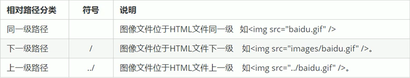

#### 6、超链接标签

```html
<a href="#" target="">文本或图像</a>
```


1. href 中的地址可以是一个文件、压缩包---------点击下载

```html
锚点链接
<a href="#two" target="">第二集</a>
<h3 id="two">第二集介绍</h3>
```

- 链接分类：

#### 7、特殊字符


#### 8、表格标签

```html
<table border="1">
    <tr>
      <td>姓名</td>
      <td>性别</td>
      <td>年龄</td>
    </tr>
    <tr>
      <td>刘德华</td>
      <td>男</td>
      <td>56</td>
    </tr>

  </table>
```

==为了突出第一行单元格引入thead==

```html
  <table >
    <tr>
        <!-- 加粗了 -->
      <th>姓名</th>
      <th>性别</th>
      <th>年龄</th>
    </tr>
    <tr>
      <td>刘德华</td>
      <td>男</td>
      <td>56</td>
    </tr>
  </table>
```

- 表格属性：

  

==引入thead和tbody==

```html
<table align="center">
    <thead>
      <tr>
        <th>姓名</th>
        <th>性别</th>
        <th>年龄</th>
      </tr>
    </thead>
    <tbody>
      <tr>
        <td>刘德华</td>
        <td>男</td>
        <td>56</td>
      </tr>
    </tbody>
  </table>
```

- 合并单元格

```html
<table align="center" border="1">
    <thead>
      <tr>
        <th>姓名</th>
        <th colspan="2">性别</th>
        
      </tr>
    </thead>
    <tbody>
      <tr>
        <td rowspan="2">刘德华</td>
        <td>男</td>
        <td>女</td>
      </tr>
      <tr>
        
        <td>男</td>
        <td>女</td>
      </tr>
    </tbody>
  </table>
```

1. 都是在列标签中使用属性
2. 水平用colspan
3. 竖直用rowspan
4. 默认至少下一个水平或者竖直位置已经被占用

#### 9、无序列表

```html
<ul>
    <li>1</li>
    <li>2</li>
    <li>3</li>
    <li>4</li>
    <li>5</li>
    <li>6</li>
  </ul>
```

1. 无序列表的各个列表项之间没有顺序级别之分，是并列的
2. <*ul><*/ul>中只能嵌套<*li><*/li>
3. <*li><*/li>之间相当于一个容器，可以容纳所有元素
4. 无序列表会带有自己的样式属性，实际使用时，可用css来设置

#### 10、有序列表

```html
<ol>
    <li>1</li>
    <li>2</li>
    <li>3</li>
    <li>4</li>
    <li>5</li>
    <li>6</li>
  </ol>
```

1. <*ol><*/ol>中只能嵌套<*li><*/li>
2. <*li><*/li>之间相当于一个容器，可以容纳所有元素
3. 无序列表会带有自己的样式属性，实际使用时，可用css来设置

#### 11、自定义列表

```html
  <dl>
    <dt>关注我们</dt>
    <dd>1</dd>
    <dd>2</dd>
    <dd>3</dd>
    <dt>关注我们</dt>
    <dd>1</dd>
    <dd>2</dd>
    <dd>3</dd>
  </dl>
```

1. dl下只能有dt/dd标签
2. dt/dd标签相当于一个容器，可以放任何标签

#### 12、表单

##### 1、input表单元素

- type属性的属性值：

  

- input中的其他属性：

  

- 实例：

  

==注意事项==

1. 单选和复选框需要定义相同的name
2. name和value是后端所需要的属性

##### 2、label标签


==总结==

1. 包在label标签下的值通过    label的属性for的值和input标签下的id值来绑定
2. 实现点击label的内容就相当于点击了input

##### 3、select表单元素


##### 4、textarea标签

- 用于多行数据

## 3、CSS

### 1、class和id使用规范

#### 1、class的使用：


==实例：==


1. 标签可以定义多个类名，类名之间用空格分开

#### 2、id的使用：


1. id选择器只运行用一次
2. 一般用于页面唯一性的元素上，经常和JavaScript搭配使用

#### 3、通配符选择器

1. 使用格式

```css
* {
    
}
```

### 2、字体属性

#### 1、font-size（文本字体的大小）


1. 注意必须加px

#### 2、font-weight（文本字体的粗细）


#### 3、font-style（文本的风格）


1. 如果想改em i标签中font-style的默认italic改了，可以改成normal

#### 4、font-family（文本的字体系列）


1. 当定义了多个字体，浏览器会从前往后选择，直到有一个是系统存在的字体

#### 5、font的使用（复合属性写法）

1. 格式：font: font-style font-weight font-size/line-height font-family;


### 3、文本属性

#### 1、color（文本的颜色）


#### 2、text-align（对其文本）

1. 本质是让盒子里面的文字水平对齐


#### 3、text-decoration（装饰文本）


#### 4、text-indent（文本的第一行缩进）


#### 5、line-height（文本的行间距）

1. 上间距/下间距=（行间距-文本大小）/2


### 4、emmet语法快速生成


- CSS中快速生成
  1. 如 w100  出来的则是width: 100px;
  2. ti26 出来的则是 text-indent: 26px;

### 5、引入style的方式

#### 1、内部样式表


#### 2、行内样式表


#### 3、外部样式表


### 6、复合选择器

#### 1、后代选择器


1. 类选择器的使用
2. 
3. 其他的如id也是一样使用
4. 对应于class为nav的后代

#### 2、子元素选择器


==实例：==


#### 3、并集选择器


#### 4、伪类选择器

- 链接伪类
  1. LVHA的顺序写，否则没有效果
  2. love hate  爱恨


- focus伪类选择器


==效果图：==


### 7、CSS中的元素显示模式

#### 1、块元素


> 实践证明，如果在p里面放块级元素则 <p>和</p>都是单独成一对，而h没影响

#### 2、行内元素


==转换成块级模式就是加上display:block;==

#### 3、行内块元素


#### 4、显示模式的转换


### 8、css中的backgroud

#### 1、背景颜色


#### 2、背景图片(与背景颜色一起用的时候，能够覆盖在背景颜色上)


==例子==

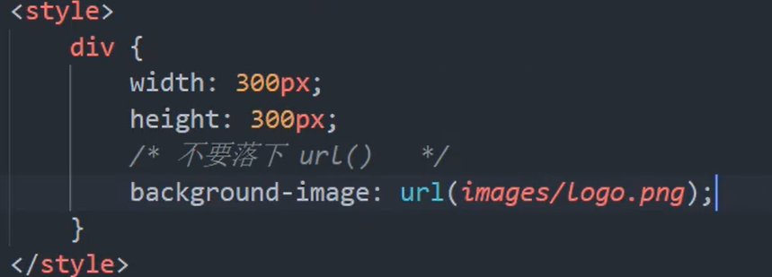


#### 3、背景平铺


> 默认情况下是平铺的

#### 4、背景图片的位置


- 参数是方位名词：


==超大背景图片居中显示重要内容==


- 参数是length：


- 参数是混合单位

  

#### 5、背景图片的固定与滚动


#### 6、背景复合写法


#### 7、背景色半透明


> 里面的内容不会有透明的变化！
>
> 越小越透明

#### 8、背景总结


### 9、CSS中的三大特性

#### 1、层叠性


#### 2、继承性


==行高的继承性==


#### 3、优先级


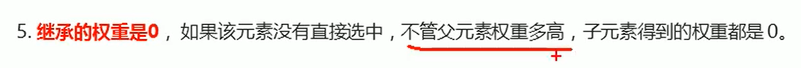

==代码例子==


==特殊的a元素：body的继承性权重比元素选择器小==


#### 3.1、权重的叠加性


> 永远不会进位

### 10、页面布局三大核心之一------盒子模型

#### 1、看透网页布局的本质


#### 2、盒子模型的组成


##### 2.1边框（border）


- 复合型+分开写


- 表格的细线边框


> 主要是border-collapse: collapse; 实现相邻边框合并

- 边框会影响盒子的大小


##### 2.2内边距（padding）

- 指定内边距的4个方式


- 内边距会撑大盒子及解决办法


> 自动撑大也是可以利用的，如可以让导航栏的各个a盒子左右上下的内边距相同，而不用固定死盒子大小

- 不会撑大盒子的情况

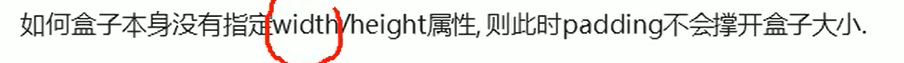

==100%也不能写==


##### 2.3外边距（margin）


==典型应用==


==行内元素或行内块元素在盒子中居中==


- 相邻外边距的合并问题（取最大值，不是1+1=2）


- 嵌套块元素垂直外边距的塌陷问题


- 清除内外边距


> 如ul>li就有默认的外边距，不同浏览器不一样

#### 3、圆角边框

- 基本使用


- 细分及常用


#### 4、盒子阴影


> inset部位默认outset但是不能写，需要改变为内部阴影的时候加上inset，其余时候不写
>
> 前四个值都以px为单位，color可以用rgba来设置透明度增强效果
>
> 只写两个px时就是代表水平和垂直的值

==使用时，大多用div:hover来表示==

#### 5、文字阴影（不常用）


### 11、PS的基本操作


### 12、页面布局三大核心之一------浮动

#### 1、传统网页布局的三种方式


#### 2、标准流


#### 3、为什么需要浮动

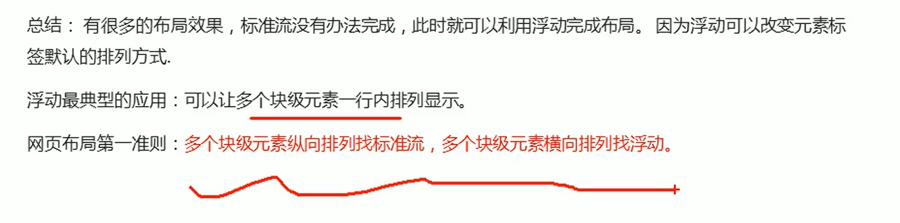

> 标准流中换成行内块元素会有不确定像素的白空隙

#### 4、什么是浮动


#### 5、浮动的特性（难点）


> 加了浮动之后，元素的特性类似于行内块元素但是已经不属于标准流

==例子==


==随着父容器变小，浮动呈现的状态就像右边向左边堆积木一样==


#### 6、浮动元素常和标准流父级搭配完成布局


==案例==


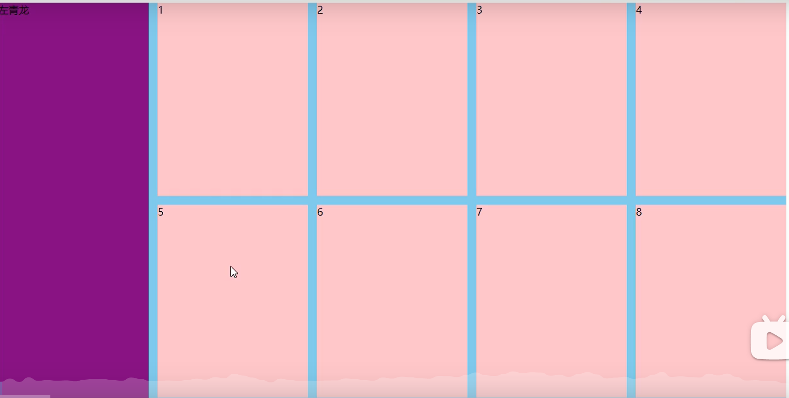

#### 7、注意点


> 重点：如果容器中有标准流，且同一个父容器中的浮动在标准流后面，则不会影响到标准流那一行
>
> 所以，如果出现下面这种前面的浮动比标准流大，而标准流后面的浮动的上边只会贴着标准流那一行的下边界，向左寻找界限


#### 8、为什么要清除浮动


#### 9、清除浮动的方法


##### 1、额外标签法


> 所谓清除影响，个人理解为是清除后面可能有标准流来影响父盒子，所以父盒子始终是看着标准流来决定撑不撑开的，解决了这个影响，则应当是可以实现浮动自动撑开盒子的

==例子，其中clear是已经规定了是一个类并含有clear:both;==


##### 2、父级添加overflow属性


##### 3、父级添加after伪元素


##### 4、父级添加双伪元素


##### 5、总结


### 13、PS切图

#### 1、常见的图片形式


> 前三个可以直接用于制作，PSD主要是获取信息

#### 2、图层切图


#### 3、切片切图


#### 4、cutterman插件

### 14、页面布局三大核心之一------定位

#### 1、为什么需要定位


#### 2、定位组成


##### 1、定位模式


##### 2、边偏移


##### 3、静态定位


##### 4、相对定位 relative(重要)


==例子==


##### 5、绝对定位 absolute （重要）


==例子==


##### 6、子绝父相的由来


##### 7、固定定位


==固定在版心右侧位置（小技巧）==


##### 8、粘性定位


> 图中top:10px;可以理解为当可视窗口距离盒子10px时，不再随着滚动条滚动变化

##### 9、定位总结


##### 10、定位叠放次序 z-index


##### 11、绝对定位水平垂直居中


##### 12、定位的特殊特性


### 15、元素的显示与隐藏

##### 1、display属性


##### 2、visibility属性


##### 3、overflow 溢出

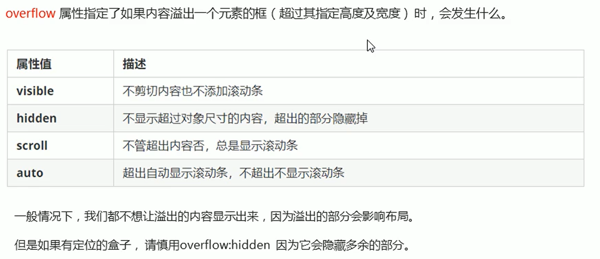

## 4、CSS高级

### 1、精灵图的使用


### 2、字体图标

#### 1、字体图标的好处


#### 2、获得字体图标


> 推荐网站：www.iconfont.cn 阿里，速度快，免费
>
> ​				   icomoon.io   成立于2011，国外服务器

#### 3、字体图标的引入

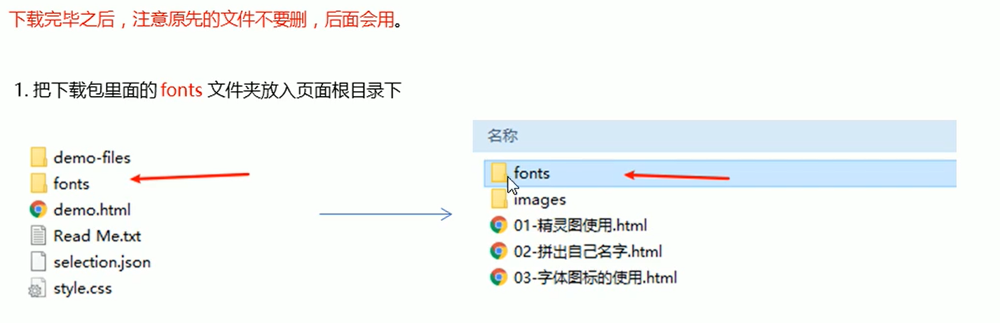

==fonts文件夹下的文件==


==多种不同的类型文件的原因==


#### 4、字体图标的使用


> 取自style.css，用于字体声明


> 小方框取自demo.html,需要将字体种类名换成规定的，然后可以进行常规字体的一切操作，如大小、颜色等

#### 5、字体图标的追加


### 3、css三角的做法


==京东实例==


### 4、用户界面样式

#### 1、鼠标样式 cursor


#### 2、轮廓线outline


#### 3、防止拖拽文本域resize


### 5、vertical-align属性应用


### 6、溢出的文字省略号显示

==单行文本溢出显示省略号==

==必须满足三个条件==


==多行文本溢出显示省略号==

==需要调节块的大小==


### 7、布局技巧

#### 1、margin负值的应用


> 使得边框可以重叠，且每个li都是先有浮动紧贴的条件之后才会执行margin的操作

==当需要使用hover时又会出现有的边框被覆盖，导致颜色不能全部显示的状况==


==解决办法如下==


#### 2、文字围绕浮动元素


==实例==


#### 3、行内块的运用


> 行内块之间本来就有空隙

#### 4、三角形强化（直角三角形）


> 总结出就是哪个border大小为0，则那个方向向内切一半

### 8、Css初始化


> 可以到各大网站查看网页源代码然后搜索body关键字提取重要信息

## 5、HTML5新特性

### 1、HTML5新增的语义标签


### 2、HTML5新增的多媒体标签

#### 1、video


==语法==


==常见属性==


> controls带来的格式在各个浏览器中不一样，需要统一的话则要用js实现

#### 2、audio


==语法==


==常见属性==


#### 3、总结


### 3、HTML5新增input类型

### 4、HTML5新增表单属性


## 6、CSS3新特性

### 1、CSS3现状


### 2、CSS3新增选择器


#### 1、属性选择器


==例子==


#### 2、结构伪类选择器

##### 1、nth-child


> 只能是n，不能换字母

==n为公式时==


> 原理：n从0开始变化，括号里面的值超出范围则无效

##### 2、nth-of-type

==区别==


==第一个是p，跟div不对应，无效==


==nth-of-type则会只看指定元素的盒子==


#### 3、伪元素选择器

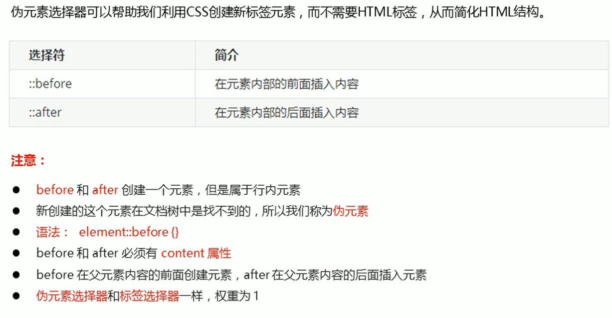

==例子（默认是行内元素）==


==应用==


==引入的字体图标的两种写法==


==土豆实例（动态遮罩层）==


### 3、盒子模型里不让padding和border撑大盒子


### 4、滤镜filter


### 5、calc函数


==实例==


### 6、transition过渡


> 最后一个属性是开始和结束前都有这个时间

==需要配合hover，实例如下==


==想宽高都改变的时候的错误写法==


> 会有冲突

==正确写法==


==推荐写法==


> 注意点：时间必须都带上单位 秒(s)

### 7、2D转换


#### 1、translate移动

==重点：不会影响其他元素的位置==


==实例==


> translateX和translateY会互相覆盖

==盒子水平垂直居中用百分号的演变==

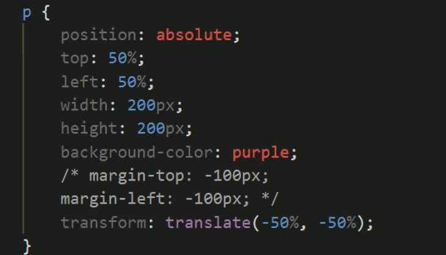

#### 2、rotate旋转


==实例==


> 还可以应用于实现小的三角

#### 3、设置转换的中心点transform-origin


==案例==

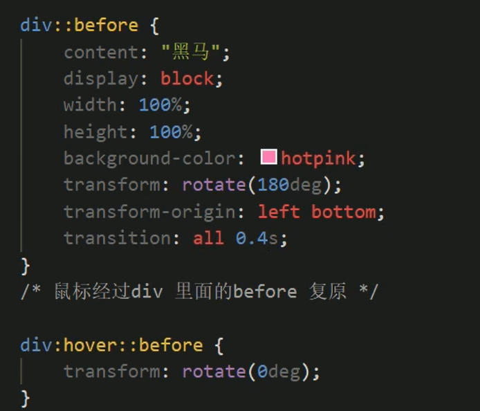


> 利用before保留原div位置

#### 4、scale缩放（可设置中心点，不影响其他盒子）


#### 5、综合写法


### 8、动画

- 需求：页面一打开，一个盒子就从左边走到右边


#### 1、keyframes定义动画


==非直接0%-100%案例==


> 0%可以省略

#### 2、何为动画序列


#### 3、调用动画


#### 4、动画常用属性


==实例==


#### 5、简写


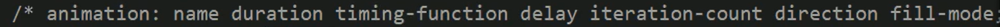

#### 6、动画的速度曲线中的steps


> 可以应用于打字机

### 9、3D转换

#### 1、3D特点


#### 2、三维坐标系


#### 3、3D转换的使用


> 必须借助于透视才能看见实际效果

#### 4、perspective透视


==透视写在被观察元素的父盒子上面==


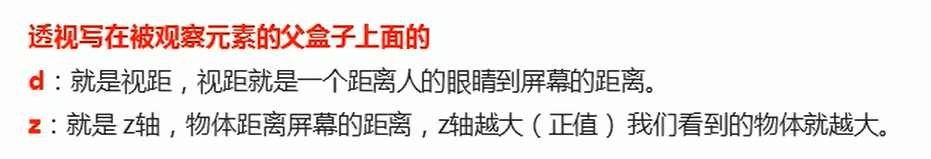

#### 5、rotate3d


==左手准则==

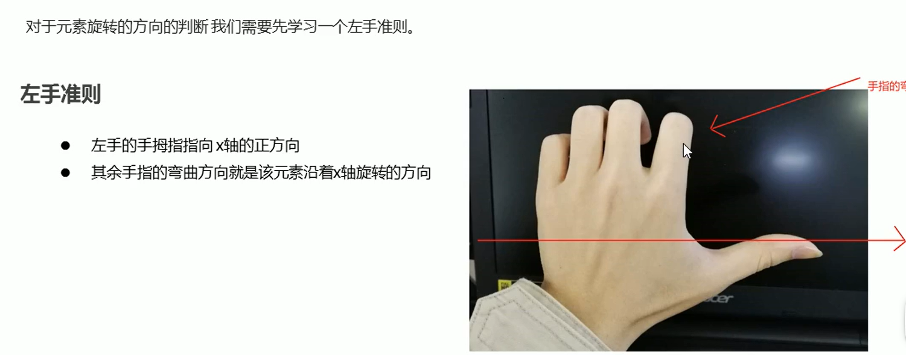

==使用rotate3d时以x，y，z的矢量旋转==


#### 6、3D呈现：transform-style

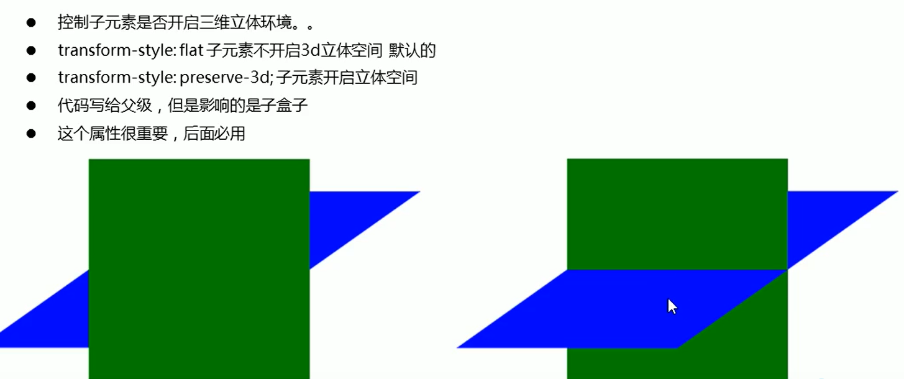

## 7、浏览器的私有前缀

