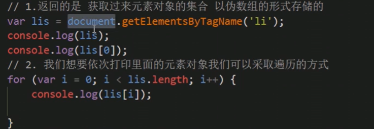
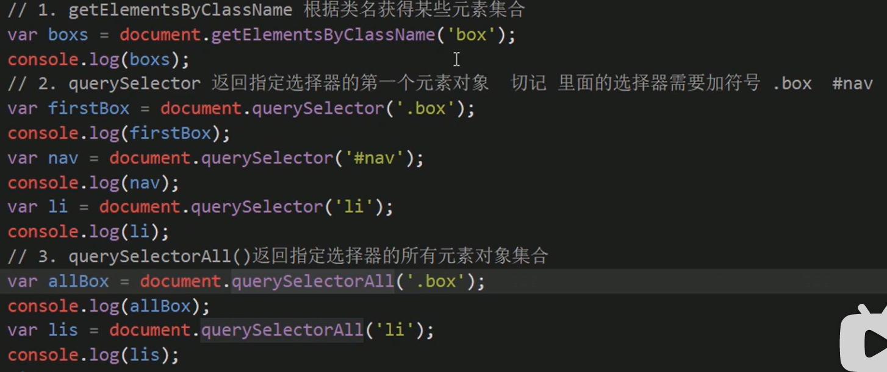
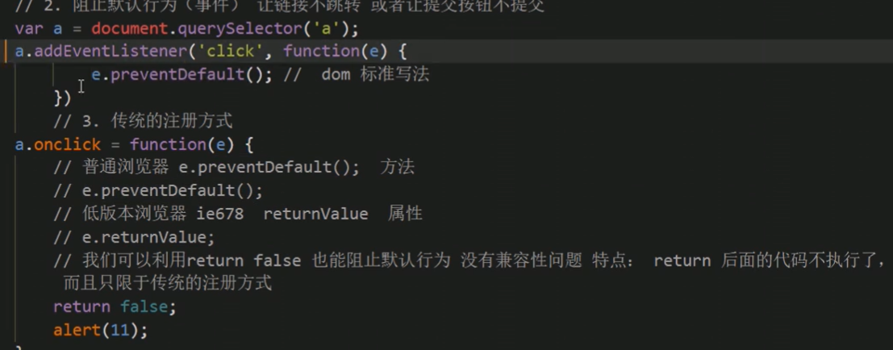
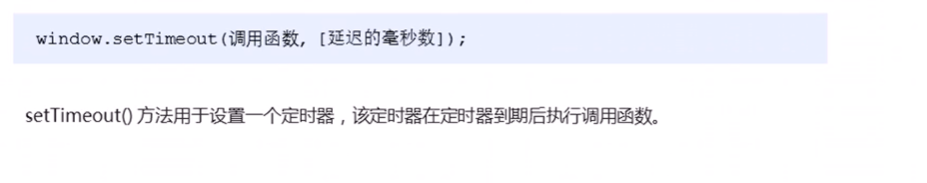
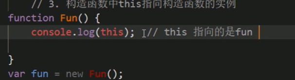
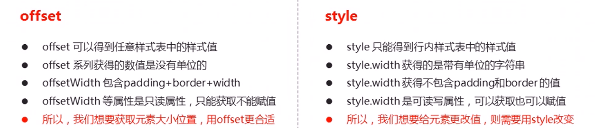
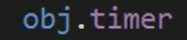

# JavaScript APIs

## 1、导读

## 2、DOM

### 1、DOM简介

#### 1、什么是DOM

#### 2、DOM树

### 2、获取元素

#### 1、如何获取页面元素

#### 2、根据ID获取（独一无二）

> console.dir();替代log 查看属性方法

#### 3、根据标签名获取

#### 4、H5新增获取元素方式

#### 5、获取特殊元素（body，html）

### 3、事件基础

#### 1、事件概述

==小例子==

#### 2、执行事件的步骤

==小例子==

#### 3、常见的鼠标事件

### 4、操作元素

#### 1、改变元素内容

##### 1、element.innerText（不识别html标签）

==也可以让网页一打开就有变化，不用注册事件==

##### 2、element.innerHTML（识别html标签并且不会去除空格和换行）

#### 2、修改元素属性

##### 1、常用元素的属性操作

#### 3、表单元素的属性操作

==用法与上面修改元素属性类似，知道了属性及含义就可==

#### 4、this就是事件函数的调用者

#### 5、样式属性操作

==第二点巧妙运用了className属性，实质将需要的class加上去，避免了繁琐的第一点写法==

==如果需要保持原先的类名，则需要这么写==

#### 6、自定义属性的操作

##### 1、获取属性值

##### 2、设置元素属性值

##### 3、移除属性

##### 4、Attribute对应的是代码中元素的属性名，元素.（对应的是对象的属性）

#### 7、H5自定义属性

##### 1、设置H5自定义属性

##### 2、获取H5自定义属性

### 5、节点操作

#### 1、为什么要有节点操作

#### 2、节点概述

#### 3、节点层级

##### 1、父级节点

##### 2、子节点 	

==两种方式的实例==

==实例==

##### 3、兄弟节点

==解决兼容性问题，封装一个函数==

##### 4、创建元素节点

#### 4、删除节点

#### 5、复制节点

##### 1、深拷贝和浅拷贝

#### 6、document.write()创建元素节点

##### 1、三种动态创建元素区别

##### 2、write()

##### 3、innerHTML和createElement

### 6、DOM重点核心

#### 1、创建

#### 2、增加

#### 3、删除

#### 4、改

#### 5、查

#### 6、属性操作

#### 7、事件操作

### 7、事件高级

#### 1、注册事件（绑定事件）

##### 1、注册事件概述

##### 2、方法监听方式addEventListener

==两种事件对比实例==

> 同一个元素同一个方式，不会被覆盖，会依次执行

##### 3、attachEvent 事件监听方式（基本不用，垃圾）

#### 2、删除事件

##### 1、兼容性解决方案

#### 3、DOM事件流

==实例==

> 先执行father再执行son

> 先son再father

#### 4、事件对象

##### 1、什么是事件对象

##### 2、事件对象的实用语法

##### 3、事件对象的兼容性方案

==实例==

##### 4、e.target和this（概念完全不同，只是有时结果相同）

##### 5、事件对象的常见属性和方法

##### 6、阻止默认行为

##### 7、阻止事件冒泡

==兼容性方案==

> 理解为鼠标点击一个地方算一个真实事件，多个监听的事件完成是通过冒泡实现的

##### 8、事件委托

##### 9、常用鼠标事件延伸

###### 1、禁止鼠标右键菜单和禁止鼠标选中

==例子==

###### 2、MouseEvent事件

##### 10、常用的键盘事件

###### 1、常用的键盘事件

###### 2、keyCode属性

###### 3、ASCII表

## 3、BOM

### 1、BOM概述

#### 1、什么是BOM

#### 2、BOM的构成

### 2、window对象的常见事件

#### 1、窗口加载事件

==实例==

#### 2、调整窗口大小事件

==实例==

#### 3、定时器

##### 1、setTimeout()

##### 2、停止setTimeout()定时器

##### 3、setInterval()定时器

##### 4、停止setInterval()定时器

### 3、this指定问题

### 4、JS执行机制

#### 1、JS是单线程

#### 2、一个问题

#### 3、同步与异步

#### 4、又一个问题

> 123

#### 5、执行机制

==小例子==

#### 6、location对象

##### 1、什么事location对象

##### 2、URL组成

##### 3、location对象的属性

##### 4、location常见的方法

#### 7、navigator对象

##### 1、userAgent属性

#### 8、history对象

## 4、PC端网页特效

### 1、元素偏移量offset系列

#### 1、offset概述

#### 2、offset与style区别

### 2、元素的可视区client系列

### 3、元素滚动scroll系列

#### 1、滚动条触发事件

### 4、mouseenter和mouseover的区别

### 5、动画函数封装

#### 1、动画原理及应用

==实例==

#### 2、简单动画的封装

#### 3、避免相同名称的定时器

> 如果将函数定义到一个button，被赋值的timer的对应定时器在变，但是之前的定时器不会消失，只有等到条件满足才会执行销毁函数