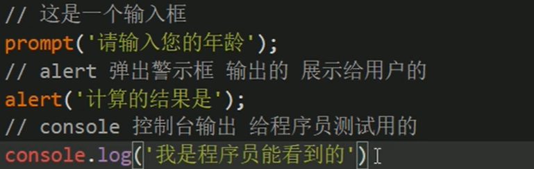
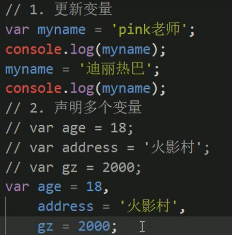
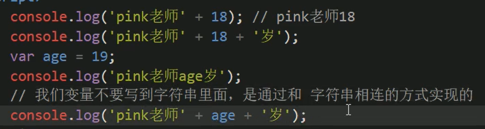
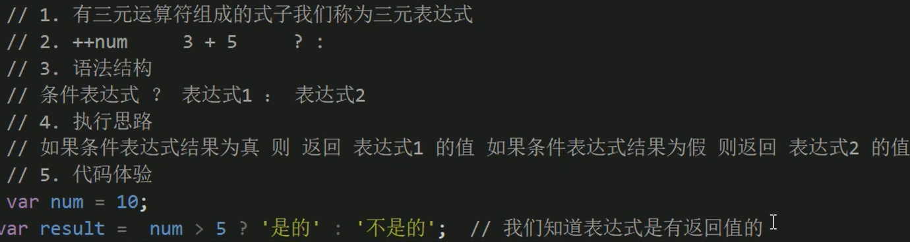
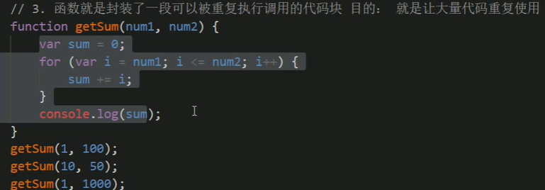
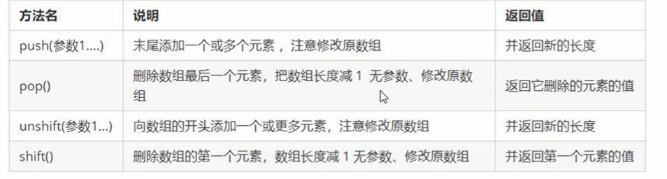
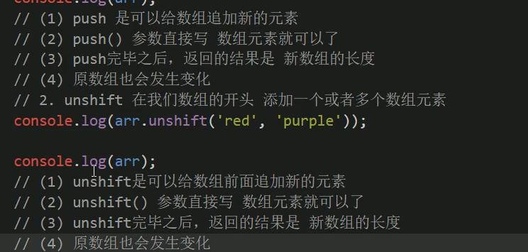

# JavaScript基础语法

- JS属于解释型语言

## JS的组成

## 1、ECMAScript

### 1、导读

#### 1、介绍

#### 2、JS的三种引入

##### 1、行内式JS

##### 2、内嵌JS

##### 3、外部JS

#### 3、JS注释

#### 4、输入输出

### 2、变量

#### 1、变量存储在内存中

#### 2、变量的使用

==输出输入的名字实例==

#### 3、语法扩展

> 不声明直接用的方式不推荐，会成为全局变量。
>
> 程序报错则不再向下执行

#### 4、命名规范

### 3、数据类型

> 根据占用内存空间不同，划分数据类型

#### 1、基本数据类型

##### 1、数字型

###### 1、数字型进制

###### 2、数字型最大最小值

###### 3、数字型的三个特殊值

==实例==

###### 4、isNaN()

##### 2、字符串型

###### 1、字符串引号嵌套

###### 2、字符串转义字符

###### 3、字符串长度

###### 4、字符串拼接

==实例==

==加强==

##### 3、Boolean布尔类型

###### 1、参与数字运算

##### 4、Undefined和null

> null是object类型

#### 2、获取变量数据类型

> 测试出一个结果：prompt输入的是一个字符型

==看控制台输出的颜色辨别数据类型==

==字面量==

#### 3、数据类型转换

##### 1、转换为字符串

##### 2、转换为数字型

##### 3、转换为布尔类型

### 4、标识符、关键字、保留字

#### 1、标识符

#### 2、关键字

#### 3、保留字

### 5、运算符

#### 1、导读

#### 2、算术运算符

==特殊的浮点数==

==表达式必有返回值==

#### 3、递增递减运算符

#### 4、比较运算符

#### 5、逻辑运算符

==&&和||的逻辑中断==

#### 6、赋值运算符

#### 7、运算符优先级

### 6、流程控制

#### 1、顺序流程控制

#### 2、分支流程控制if

#### 3、三元表达式

#### 4、switch

> 是全等匹配

### 7、循环

#### 1、for循环

> 可以在sources中打断点

#### 2、while循环

#### 3、do-while循环

#### 4、continue

#### 5、break

### 8、数组

#### 1、数组的概念

#### 2、创建数组

##### 1、利用new创建数组

##### 2、利用数组字面量创建数组（常用）

- 可以存任何数据类型

#### 3、获取数组元素

##### 1、数组的索引

==数组的长度==

#### 4、数组中新增元素

### 9、函数

#### 1、函数的概念

#### 2、函数的使用

##### 1、声明函数

##### 2、函数调用

#### 3、函数的封装

#### 4、函数的参数

##### 1、当形参和实参个数不匹配时（不会报错）

#### 5、函数的返回

==不需要声明类型，直接用return返回==

==如果没有return，则默认返回undefined==

#### 6、arguments的使用

#### 7、函数的两种声明方式

### 10、JS的作用域

==ES6加入了块级作用域==

##### 作用域链

### 11、JS的预解析

==变量只是声明没有赋值，赋值是一种操作==

==函数声明时，如果用赋值声明函数则会报错，因为本质还是变量==

### 12、对象

#### 1、字面量创建对象

#### 2、new创建对象

#### 3、遍历对象

### 13、构造函数

#### 1、为什么要构造函数

#### 2、构造函数的使用

#### 3、构造函数被调用时的执行过程

### 14、内置对象

==MDN中查文档==

#### 1、常用Math对象

#### 2、常用Date日期对象

##### 1、获得总秒数

#### 3、数组对象

##### 1、创建数组的两种方式

##### 2、检测是否为数组的两种方式

##### 3、添加删除数组的函数

##### 4、获取数组中某元素的索引

##### 5、转换为字符串方法

> join默认是逗号(,)分隔

#### 4、字符串对象

##### 1、基本包装类型

##### 2、字符串的不可变

##### 3、根据字符返回index

##### 4、根据位置返回字符（重点）

##### 5、字符串操作方法

##### 6、替换字符replace

##### 7、字符转换为数组split('分隔符')

