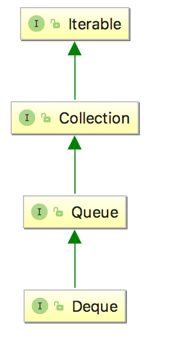
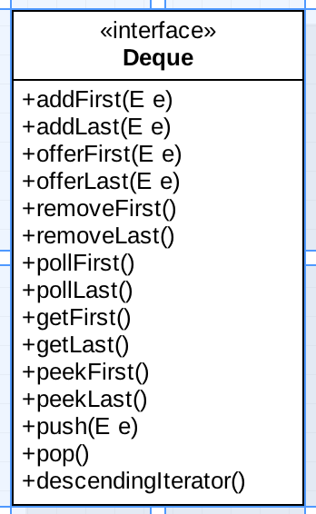

# Java常用类

## 1、日期类

### 1、jdk 8中日期时间API

- LocalDate、LocalTime和LocalDateTime

#### 1、now()静态方法（得到现在的时间）

```java
LocalDate localDate = LocalDate.now();
LocalTime localTime = LocalTime.now();
LocalDateTime localDateTime = LocalDateTime.now();
System.out.println(localDate);
System.out.println(localTime);
System.out.println(localDateTime);

》
2021-04-06
17:23:50.611
2021-04-06T17:23:50.611
```

#### 2、of()静态方法（初始化）

```java
//of():设置指定的年、月、日、时、分、秒。没有偏移量
LocalDateTime localDateTime1 = LocalDateTime.of(
        2020, 10, 6,
        13, 23, 43);
System.out.println(localDateTime1);

》
2020-10-06T13:23:43
```

#### 3、getXxx()静态方法（得到精确的日期对象的时间）

```java
//getXxx()：获取相关的属性
System.out.println(localDateTime.getDayOfMonth());
System.out.println(localDateTime.getDayOfWeek());
System.out.println(localDateTime.getMonth());
System.out.println(localDateTime.getMonthValue());
System.out.println(localDateTime.getMinute());
//现在是4.6 周二
》
6
TUESDAY
APRIL
4
30
```

#### 4、不可变性

```java
//体现不可变性
//withXxx():设置相关的属性
LocalDate localDate1 = localDate.withDayOfMonth(22);
System.out.println(localDate);
System.out.println(localDate1);


LocalDateTime localDateTime2 = localDateTime.withHour(4);
System.out.println(localDateTime);
System.out.println(localDateTime2);

》
2021-04-06
2021-04-22
2021-04-06T17:37:23.211
2021-04-06T04:37:23.211
```

```java
//不可变性
LocalDateTime localDateTime3 = localDateTime.plusMonths(3);
System.out.println(localDateTime);
System.out.println(localDateTime3);

LocalDateTime localDateTime4 = localDateTime.minusDays(6);
System.out.println(localDateTime);
System.out.println(localDateTime4);


》
2021-04-06T17:38:56.331
2021-07-06T17:38:56.331
2021-04-06T17:38:56.331
2021-03-31T17:38:56.331
```

### 2、jdk 8之前的日历类

```java
public void testCalendar(){
    //1.实例化
    //方式一：创建其子类（GregorianCalendar）的对象
    //方式二：调用其静态方法getInstance()
    Calendar calendar = Calendar.getInstance();
    System.out.println(calendar.getClass());

    //2.常用方法
    //get()
    int days = calendar.get(Calendar.DAY_OF_MONTH);
    System.out.println(days);
    System.out.println(calendar.get(Calendar.DAY_OF_YEAR));

    //set()
    //calendar可变性
    calendar.set(Calendar.DAY_OF_MONTH,22);
    days = calendar.get(Calendar.DAY_OF_MONTH);
    System.out.println(days);

    //add()
    calendar.add(Calendar.DAY_OF_MONTH,-3);
    days = calendar.get(Calendar.DAY_OF_MONTH);
    System.out.println(days);

    //getTime():日历类---> Date
    Date date = calendar.getTime();
    System.out.println(date);

    //setTime():Date ---> 日历类
    Date date1 = new Date();
    calendar.setTime(date1);
    days = calendar.get(Calendar.DAY_OF_MONTH);
    System.out.println(days);

}
》
class java.util.GregorianCalendar
6
96
22
19
Mon Apr 19 17:55:22 CST 2021
6
```

### 3、JDK 8之前的 Date类

#### 1、两个构造器的使用

```java
//构造器一：Date()：创建一个对应当前时间的Date对象
Date date1 = new Date();
System.out.println(date1.toString());

System.out.println(date1.getTime());

//构造器二：创建指定毫秒数的Date对象
Date date2 = new Date(1617703532445L);
System.out.println(date2.toString());

》
Tue Apr 06 18:06:02 CST 2021
1617703562228
Tue Apr 06 18:05:32 CST 2021
```

#### 2、创建java.sql.Date对象

```java
//创建java.sql.Date对象
java.sql.Date date3 = new java.sql.Date(1617703532445L);
System.out.println(date3);

》
2021-04-06
```

#### 3、java.util.Date转java.sql.Date

```java
//如何将java.util.Date对象转换为java.sql.Date对象
        //情况一：
//        Date date4 = new java.sql.Date(1617703532445L);
//        java.sql.Date date5 = (java.sql.Date) date4;
        //情况二：
        Date date6 = new Date();
        java.sql.Date date7 = new java.sql.Date(date6.getTime());
```

#### 4、取得当前时间的时间戳

```java
long time = System.currentTimeMillis();
//返回当前时间与1970年1月1日0时0分0秒之间以毫秒为单位的时间差。
//称为时间戳
System.out.println(time);
》
1617703792147
```

```java
//与这个一个意思
Date date = new Date();
System.out.println(date.getTime());
```

#### 5、格式化与自定义时间的时间戳

```java
public void testExer() throws ParseException {
        String birth = "2020-09-08";

        SimpleDateFormat sdf1 = new SimpleDateFormat("yyyy-MM-dd");
        Date date = sdf1.parse(birth);
//        System.out.println(date);

        java.sql.Date birthDate = new java.sql.Date(date.getTime());
        System.out.println(birthDate);
    }
```

```java
//总天数的计算？
//方式一：( date2.getTime() - date1.getTime()) / (1000 * 60 * 60 * 24) + 1
//方式二：1990-01-01  --> 2019-12-31  +  2020-01-01 -->2020-09-08

public void test2() throws ParseException {
        String str1 = "2020-02-10";
        String str2 = "2020-03-01";
        SimpleDateFormat sm = new SimpleDateFormat("yyyy-MM-dd");
        Date parse1 = sm.parse(str1);
        Date parse2 = sm.parse(str2);
        long days = (parse2.getTime() - parse1.getTime())/(1000*60*60*24)+1;
        System.out.println(days);
    }
》
21
```

## 2、Scanner类

### 1、实例化

```java
Scanner sc= new Scanner(System.in);
```

### 2、输入一个int、double、String、一整行

```java
 //输入一个int、double、String、一整行
        int num = sc.nextInt();
        double db = sc.nextDouble();
        String s = sc.next();
        String ss = sc.nextLine();
        System.out.println(num);
        System.out.println(db);
        System.out.println(s);
        System.out.println(ss);
//        输入
//        1 1.0 q 312432141
//        输出
//        1
//        1.0
//        q
//         312432141
```

### 3、hasNext

```java
//判断是否有下一个输入
        //记录下每一个String
        // int、double与此相似
        String s;
        while (sc.hasNext()) {
            s = sc.next();
            System.out.println(s);
        }

//        qw weqw
//        qw
//        weqw
//
//        432
//        432
```

```java
 //记录下每一行String
        while (sc.hasNextLine()) {
            s = sc.nextLine();
            System.out.println(s);
        }
//        qw weqw
//        qw weqw
//        weweqw 234e32
//        weweqw 234e32
//
//
//        432
//        432
```

### 4、输入以0结束

```java
//输入为0结束
int num;
while ((num = sc.nextInt())!=0){
    System.out.println(num);
}
```

### 5、输入以空结束

```java
//输入为空结束
        //错误实例：
        //next()永远接收不到""
        String s;
        while (!(s = sc.next()).equals("")){
            System.out.println(s);
        }
        //理解为输入为空行结束
        //这样才能获得为空的数据
        String s;
        while (!(s = sc.nextLine()).equals("")){
            System.out.println(s);
        }
//        21312
//        21421
//        3435
//        erw
```

### 6、输入n行数据

```java
//输入n行数据，nextInt后的第一个nextLine检测到换行会接收掉空的字符串""
        int n = sc.nextInt();
//接收掉nextInt()输入完后的\n
//接收到的是\n之前的数据，若直接\n则为""，否则会获得输入的int之外的数据
        String ss = sc.nextLine();
        System.out.println(ss);
        while (n-- > 0) {
            String s = sc.nextLine();
            System.out.println(s);
        }
        //输入
//        3
//        1
//        2
//        3
        //输出
//
//        1
//        2
//        3
```

## 3、输出

### 1、输出转义字符

```java
System.out.println("\\n");
//输出
\n
```

### 2、连接字符串以使用转义字符

```java
System.out.print("\n"+324);
//输出

324
```

### 3、综合应用

```java
System.out.print(213);
System.out.print("\t");
System.out.print(3434);
System.out.print("\n"+324);
System.out.println("\\n");
//输出
213	3434
324\n
```

## 4、String、StringBuilderBuffer

### 1、效率比较

StringBuilder>StringBuffer>>String

> String的连接字符串操作会增加很多内存，从而浪费时间

### 2、StringBuffer或StringBuilder常用方法

```java
 /*
    StringBuffer的常用方法：
StringBuffer append(xxx)：提供了很多的append()方法，用于进行字符串拼接
StringBuffer delete(int start,int end)：删除指定位置的内容
StringBuffer replace(int start, int end, String str)：把[start,end)位置替换为str
StringBuffer insert(int offset, xxx)：在指定位置插入xxx
StringBuffer reverse() ：把当前字符序列逆转
public int indexOf(String str)
public String substring(int start,int end):返回一个从start开始到end索引结束的左闭右开区间的子字符串
public int length()
public char charAt(int n )
public void setCharAt(int n ,char ch)

        总结：
        增：append(xxx)
        删：delete(int start,int end)
        改：setCharAt(int n ,char ch) / replace(int start, int end, String str)
        查：charAt(int n )
        插：insert(int offset, xxx)
        长度：length();
        *遍历：for() + charAt() / toString()
     */

String s = "123456";
        StringBuilder stringBuilder1 = new StringBuilder(s);
//        StringBuilder[] stringBuilder1 = new StringBuilder[3];
//        stringBuilder1[0] = new StringBuilder("abc");
//        stringBuilder1[1] = new StringBuilder("abd");
//        stringBuilder1[2] = new StringBuilder("aba");
//        Arrays.sort(stringBuilder1);
//        for (int i=0;i<stringBuilder1.length;i++){
//            System.out.println(stringBuilder1[i]);
//        }
        //异常java.lang.ClassCastException: java.lang.StringBuilder cannot be cast to java.lang.Comparable
       //没重写equals和compareTo方法

        stringBuilder1.delete(0,2);
        System.out.println(stringBuilder1);
        stringBuilder1.replace(0, 2, "99");
        System.out.println(stringBuilder1);
```

### 3、String常用方法

```java
/*
替换：
String replace(char oldChar, char newChar)：返回一个新的字符串，它是通过用 newChar 替换此字符串中出现的所有 oldChar 得到的。
String replace(CharSequence target, CharSequence replacement)：使用指定的字面值替换序列替换此字符串所有匹配字面值目标序列的子字符串。
String replaceAll(String regex, String replacement)：使用给定的 replacement 替换此字符串所有匹配给定的正则表达式的子字符串。
String replaceFirst(String regex, String replacement)：使用给定的 replacement 替换此字符串匹配给定的正则表达式的第一个子字符串。
匹配:
boolean matches(String regex)：告知此字符串是否匹配给定的正则表达式。
切片：
String[] split(String regex)：根据给定正则表达式的匹配拆分此字符串。
String[] split(String regex, int limit)：根据匹配给定的正则表达式来拆分此字符串，最多不超过limit个，如果超过了，剩下的全部都放到最后一个元素中。

     */

    /*
boolean endsWith(String suffix)：测试此字符串是否以指定的后缀结束
boolean startsWith(String prefix)：测试此字符串是否以指定的前缀开始
boolean startsWith(String prefix, int toffset)：测试此字符串从指定索引开始的子字符串是否以指定前缀开始

boolean contains(CharSequence s)：当且仅当此字符串包含指定的 char 值序列时，返回 true
int indexOf(String str)：返回指定子字符串在此字符串中第一次出现处的索引
int indexOf(String str, int fromIndex)：返回指定子字符串在此字符串中第一次出现处的索引，从指定的索引开始
int lastIndexOf(String str)：返回指定子字符串在此字符串中最右边出现处的索引
int lastIndexOf(String str, int fromIndex)：返回指定子字符串在此字符串中最后一次出现处的索引，从指定的索引开始反向搜索

注：indexOf和lastIndexOf方法如果未找到都是返回-1

     */

     /*
int length()：返回字符串的长度： return value.length
char charAt(int index)： 返回某索引处的字符return value[index]
boolean isEmpty()：判断是否是空字符串：return value.length == 0
String toLowerCase()：使用默认语言环境，将 String 中的所有字符转换为小写
String toUpperCase()：使用默认语言环境，将 String 中的所有字符转换为大写
String trim()：返回字符串的副本，忽略前导空白和尾部空白
boolean equals(Object obj)：比较字符串的内容是否相同
boolean equalsIgnoreCase(String anotherString)：与equals方法类似，忽略大小写
String concat(String str)：将指定字符串连接到此字符串的结尾。 等价于用“+”
int compareTo(String anotherString)：比较两个字符串的大小
String substring(int beginIndex)：返回一个新的字符串，它是此字符串的从beginIndex开始截取到最后的一个子字符串。
String substring(int beginIndex, int endIndex) ：返回一个新字符串，它是此字符串从beginIndex开始截取到endIndex(不包含)的一个子字符串。

     */
public void test1() {
        String str = "123";
        //左闭右开
        String str1 = str.substring(0,2);
        System.out.println(str1);
        //String中的compareTo实现了字典序
        String[] ss = new String[2];
        ss[0] = "qwf";
        ss[1] = "qwe";
    //字典序
        Arrays.sort(ss);
        for (int i =0;i<ss.length;i++) {
            System.out.println(ss[i]);
        }
        //输出
//        qwe
//        qwf
```

### 4、String与StringBuilder方法的差异总结

1. 用String的地方
2. 大小写、去空格、排序、equals。
3. 正则：replace、matches、split
4. 其余都用StringBuilder

> 所有有起始index和结束index的都是左闭右开

## 5、集合

### 1、List

```java
/**
 * 1. List接口框架
 *
 *    |----Collection接口：单列集合，用来存储一个一个的对象
 *          |----List接口：存储有序的、可重复的数据。  -->“动态”数组,替换原有的数组
 *              |----ArrayList：作为List接口的主要实现类；线程不安全的，效率高；底层使用Object[] elementData存储
 *              |----LinkedList：对于频繁的插入、删除操作，使用此类效率比ArrayList高；底层使用双向链表存储
 *              |----Vector：作为List接口的古老实现类；线程安全的，效率低；底层使用Object[] elementData存储
 *
 *
 *   2. ArrayList的源码分析：
 *   2.1 jdk 7情况下
 *      ArrayList list = new ArrayList();//底层创建了长度是10的Object[]数组elementData
 *      list.add(123);//elementData[0] = new Integer(123);
 *      ...
 *      list.add(11);//如果此次的添加导致底层elementData数组容量不够，则扩容。
 *      默认情况下，扩容为原来的容量的1.5倍，同时需要将原有数组中的数据复制到新的数组中。
 *
 *      结论：建议开发中使用带参的构造器：ArrayList list = new ArrayList(int capacity)
 *
 *   2.2 jdk 8中ArrayList的变化：
 *      ArrayList list = new ArrayList();//底层Object[] elementData初始化为{}.并没有创建长度为10的数组
 *
 *      list.add(123);//第一次调用add()时，底层才创建了长度10的数组，并将数据123添加到elementData[0]
 *      ...
 *      后续的添加和扩容操作与jdk 7 无异。
 *   2.3 小结：jdk7中的ArrayList的对象的创建类似于单例的饿汉式，而jdk8中的ArrayList的对象
 *            的创建类似于单例的懒汉式，延迟了数组的创建，节省内存。
 *
 *  3. LinkedList的源码分析：
 *      LinkedList list = new LinkedList(); 内部声明了Node类型的first和last属性，默认值为null
 *      list.add(123);//将123封装到Node中，创建了Node对象。
 *
 *      其中，Node定义为：体现了LinkedList的双向链表的说法
 *      private static class Node<E> {
             E item;
             Node<E> next;
             Node<E> prev;

             Node(Node<E> prev, E element, Node<E> next) {
             this.item = element;
             this.next = next;
             this.prev = prev;
             }
         }
 *
 *   4. Vector的源码分析：jdk7和jdk8中通过Vector()构造器创建对象时，底层都创建了长度为10的数组。
 *      在扩容方面，默认扩容为原来的数组长度的2倍。
 *
 *  面试题：ArrayList、LinkedList、Vector三者的异同？
 *  同：三个类都是实现了List接口，存储数据的特点相同：存储有序的、可重复的数据
 *  不同：见上
 *
 *
 * 

/*
void add(int index, Object ele):在index位置插入ele元素
boolean addAll(int index, Collection eles):从index位置开始将eles中的所有元素添加进来
Object get(int index):获取指定index位置的元素
int indexOf(Object obj):返回obj在集合中首次出现的位置
int lastIndexOf(Object obj):返回obj在当前集合中末次出现的位置
Object remove(int index):移除指定index位置的元素，并返回此元素
Object set(int index, Object ele):设置指定index位置的元素为ele
List subList(int fromIndex, int toIndex):返回从fromIndex到toIndex位置的子集合

总结：常用方法
增：add(Object obj)
删：remove(int index) / remove(Object obj)
改：set(int index, Object ele)
查：get(int index)
插：add(int index, Object ele)
长度：size()
遍历：① Iterator迭代器方式
     ② 增强for循环
     ③ 普通的循环

     */
```

> 频繁插入删除时使用LinkedList，其余时候都用ArrayList

### 2、Set

```java
//1.contains(Object obj):判断当前集合中是否包含obj
//我们在判断时会调用obj对象所在类的equals()。
 //2.containsAll(Collection coll1):判断形参coll1中的所有元素是否都存在于当前集合中。
//3.remove(Object obj):从当前集合中移除obj元素。
//4. removeAll(Collection coll1):差集：从当前集合中移除coll1中所有的元素。
//5.retainAll(Collection coll1):交集：获取当前集合和coll1集合的交集，并返回给当前集合
 //6.equals(Object obj):要想返回true，需要当前集合和形参集合的元素都相同。
//7.hashCode():返回当前对象的哈希值
//8.集合 --->数组：toArray()
//9.iterator():返回Iterator接口的实例，用于遍历集合元素。放在IteratorTest.java中测试
```

> 其中equals方法，在Set中因为无序，所以值相同就行，但是在Collection中就不行，但是所谓的值相同，在类中需要写特定的equals，不过set的存在就该有equals和hashcode方法的重写

### 3、HashSet、LinkedHashSet

```java
/*
* 1. Set接口的框架：
*
* |----Collection接口：单列集合，用来存储一个一个的对象
*          |----Set接口：存储无序的、不可重复的数据   -->高中讲的“集合”
*              |----HashSet：作为Set接口的主要实现类；线程不安全的；可以存储null值
*                  |----LinkedHashSet：作为HashSet的子类；遍历其内部数据时，可以按照添加的顺序遍历
*                                      对于频繁的遍历操作，LinkedHashSet效率高于HashSet.
*              |----TreeSet：可以按照添加对象的指定属性，进行排序。
*
*
*  1. Set接口中没有额外定义新的方法，使用的都是Collection中声明过的方法。
*
*  2. 要求：向Set(主要指：HashSet、LinkedHashSet)中添加的数据，其所在的类一定要重写hashCode()和equals()
*     要求：重写的hashCode()和equals()尽可能保持一致性：相等的对象必须具有相等的散列码
*      重写两个方法的小技巧：对象中用作 equals() 方法比较的 Field，都应该用来计算 hashCode 值。
*
*/
```

```java
/*
一、Set：存储无序的、不可重复的数据
以HashSet为例说明：
1. 无序性：不等于随机性。存储的数据在底层数组中并非按照数组索引的顺序添加，而是根据数据的哈希值决定的。

2. 不可重复性：保证添加的元素按照equals()判断时，不能返回true.即：相同的元素只能添加一个。

二、添加元素的过程：以HashSet为例：
    我们向HashSet中添加元素a,首先调用元素a所在类的hashCode()方法，计算元素a的哈希值，
    此哈希值接着通过某种算法计算出在HashSet底层数组中的存放位置（即为：索引位置），判断
    数组此位置上是否已经有元素：
        如果此位置上没有其他元素，则元素a添加成功。 --->情况1
        如果此位置上有其他元素b(或以链表形式存在的多个元素），则比较元素a与元素b的hash值：
            如果hash值不相同，则元素a添加成功。--->情况2
            如果hash值相同，进而需要调用元素a所在类的equals()方法：
                   equals()返回true,元素a添加失败
                   equals()返回false,则元素a添加成功。--->情况2

    对于添加成功的情况2和情况3而言：元素a 与已经存在指定索引位置上数据以链表的方式存储。
    jdk 7 :元素a放到数组中，指向原来的元素。
    jdk 8 :原来的元素在数组中，指向元素a
    总结：七上八下

    HashSet底层：数组+链表的结构。

 */
```

```java
//LinkedHashSet的使用
//LinkedHashSet作为HashSet的子类，在添加数据的同时，每个数据还维护了两个引用，记录此数据前一个
//数据和后一个数据。
//优点：对于频繁的遍历操作，LinkedHashSet效率高于HashSet
```

> 无序性，依赖于对象的equals和hashcode方法

### 4、TreeSet

```java
/*
1.向TreeSet中添加的数据，要求是相同类的对象。
2.两种排序方式：自然排序（实现Comparable接口） 和 定制排序（Comparator）


3.自然排序中，比较两个对象是否相同的标准为：compareTo()返回0.不再是equals().
4.定制排序中，比较两个对象是否相同的标准为：compare()返回0.不再是equals().
 */
```

```java
//定制排序
Comparator com = new Comparator() {
    //按照年龄从小到大排列
    @Override
    public int compare(Object o1, Object o2) {
        if(o1 instanceof User && o2 instanceof User){
            User u1 = (User)o1;
            User u2 = (User)o2;
            System.out.println(u1.getAge());
            System.out.println(u2.getAge());
            System.out.println(Integer.compare(u1.getAge(), u2.getAge()));
            return Integer.compare(u1.getAge(),u2.getAge());
        }else{
            throw new RuntimeException("输入的数据类型不匹配");
        }
    }
};

TreeSet set = new TreeSet(com);
```

```java
//自然排序
TreeSet set = new TreeSet();

        //失败：不能添加不同类的对象
//        set.add(123);
//        set.add(456);
//        set.add("AA");
//        set.add(new User("Tom",12));

            //举例一：
//        set.add(34);
//        set.add(-34);
//        set.add(43);
//        set.add(11);
//        set.add(8);

        //举例二：
        set.add(new User("Tom",12));
        set.add(new User("Jerry",32));
        set.add(new User("Jim",2));
        set.add(new User("Mike",65));
        set.add(new User("Jack",33));
        set.add(new User("Jack",56));
```

> 自然排序需要此对象实现了comparable接口，否则会抛异常

### 5、Map

```java
/*
添加、删除、修改操作：
Object put(Object key,Object value)：将指定key-value添加到(或修改)当前map对象中
void putAll(Map m):将m中的所有key-value对存放到当前map中
Object remove(Object key)：移除指定key的key-value对，并返回value
void clear()：清空当前map中的所有数据
元素查询的操作：
Object get(Object key)：获取指定key对应的value
boolean containsKey(Object key)：是否包含指定的key
boolean containsValue(Object value)：是否包含指定的value
int size()：返回map中key-value对的个数
boolean isEmpty()：判断当前map是否为空
boolean equals(Object obj)：判断当前map和参数对象obj是否相等
元视图操作的方法：
Set keySet()：返回所有key构成的Set集合
Collection values()：返回所有value构成的Collection集合
Set entrySet()：返回所有key-value对构成的Set集合

*总结：常用方法：
* 添加：put(Object key,Object value)
* 删除：remove(Object key)
* 修改：put(Object key,Object value)
* 查询：get(Object key)
* 长度：size()
* 遍历：keySet() / values() / entrySet()
    */
```

> 也是无序的，和set的添加方式类似，都需要hashcode和equals方法

### 6、Queue

#### 1、Deque

##### 定义

双向队列：支持插入删除元素的线性集合

##### 特性：

1. 插入、删除、获取操作支持两种形式：快速失败和返回*null*或*true/false*
2. 既具有FIFO特点又具有LIFO特点，即是队列又是栈
3. 不推荐插入*null*元素，*null*作为特定返回值表示队列为空
4. 未定义基于元素相等的equals和hashCode

##### UML类图



##### Deque继承关系




接口操作

##### 接口分析

##### 双向队列操作

###### 插入元素

- **addFirst():** 向队头插入元素，如果元素为空，则发生NPE
- **addLast():** 向队尾插入元素，如果为空，则发生NPE
- **offerFirst():** 向队头插入元素，如果插入成功返回true，否则返回false
- **offerLast():** 向队尾插入元素，如果插入成功返回true，否则返回false

###### 移除元素

- **removeFirst():** 返回并移除队头元素，如果该元素是*null*，则发生*NoSuchElementException*
- **removeLast():** 返回并移除队尾元素，如果该元素是*null*，则发生*NoSuchElementException*
- **pollFirst():** 返回并移除队头元素，如果队列无元素，则返回*null*
- **pollLast():** 返回并移除队尾元素，如果队列无元素，则返回*null*

###### 获取元素

- **getFirst():** 获取队头元素但不移除，如果队列无元素，则发生*NoSuchElementException*
- **getLast():** 获取队尾元素但不移除，如果队列无元素，则发生*NoSuchElementException*
- **peekFirst():** 获取队头元素但不移除，如果队列无元素，则返回*null*
- **peekLast():** 获取队尾元素但不移除，如果队列无元素，则返回*null*

##### 栈操作

**pop():** 弹出栈中元素，也就是返回并移除队头元素，等价于`removeFirst()`，如果队列无元素，则发生*NoSuchElementException*

**push():** 向栈中压入元素，也就是向队头增加元素，等价于`addFirst()`，如果元素为*null*，则发生NPE，如果栈空间受到限制，则发生*IllegalStateException*

##### 应用场景

1. 满足FIFO场景时
2. 满足LIFO场景时，曾经在解析XML按标签时使用过栈这种数据结构，但是却选择`Stack`类，如果在进行栈选型时，更推荐使用`Deque`类，应为`Stack`是线程同步

##### 主要实现

- **ArrayDeque:** 基于数组实现的线性双向队列
- **LinkedList:** 基于链表实现的链式双向队列

## 6、大数类

### 1、BigInteger类

```java
String s = "21";
        BigInteger bigInteger = new BigInteger(s);
//        int j = Integer.parseInt(String.valueOf(bigInteger));
        System.out.println(bigInteger);
        BigInteger e = bigInteger.add(new BigInteger(String.valueOf(6)));
        System.out.println(e);
        e = bigInteger.subtract(new BigInteger(String.valueOf(6)));
        System.out.println(e);
        e = bigInteger.multiply(new BigInteger(String.valueOf(6)));
        System.out.println(e);
        e = bigInteger.divide(new BigInteger(String.valueOf(6)));
        System.out.println(e);
        e = bigInteger.mod(new BigInteger(String.valueOf(6)));
        System.out.println(e);

//输出
21
27
15
126
3
3
```

### 2、BigDecimal类

```java
BigDecimal bigDecimal = new BigDecimal(11);
BigDecimal bigDecimal1 = new BigDecimal(3);
System.out.println(bigDecimal.divide(bigDecimal1,2,BigDecimal.ROUND_DOWN));
System.out.println(bigDecimal.divide(bigDecimal1,2,BigDecimal.ROUND_CEILING));
System.out.println(bigDecimal.divide(bigDecimal1,2,BigDecimal.ROUND_HALF_UP));
System.out.println("----------------------------------");
BigDecimal bigDecimal2 = new BigDecimal(10);
BigDecimal bigDecimal3 = new BigDecimal(3);
System.out.println(bigDecimal2.divide(bigDecimal3,2,BigDecimal.ROUND_DOWN));
System.out.println(bigDecimal2.divide(bigDecimal3,2,BigDecimal.ROUND_CEILING));
System.out.println(bigDecimal2.divide(bigDecimal3,2,BigDecimal.ROUND_HALF_UP));
System.out.println(BigDecimal.ROUND_HALF_UP);
System.out.println("==========================================");
BigDecimal bigDecimal4 = new BigDecimal("0.312526");
System.out.println(bigDecimal4.setScale(3, 1));
System.out.println(bigDecimal4.setScale(3, 2));
System.out.println(bigDecimal4.setScale(3, 4));
//或者用RoundingMode

//输出
3.66
3.67
3.67
----------------------------------
3.33
3.34
3.33
4
==========================================
0.312
0.313
0.313

Process finished with exit code 0

```


