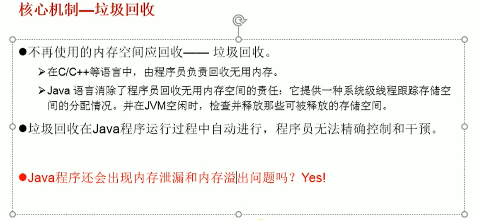

# 1    Java笔记

## 1、java基础

### 1、计算机概述

#### 1、工程师学习思维

1. 大处着眼，小处着手
2. 逆向思维，反证法
3. 透过问题看本质

#### 2、硬件和软件

1. 计算机包括硬件（hardware）和软件（software）
2. 硬件包括计算机中可以看得见的物理部分，软件提供看不见的指令。
3. 这些指令控制硬件并且使得硬件完成特定的任务

#### 3、程序设计语言

1. 软件开发人员在称为程序设计语言的强大工具的帮助下创建软件

#### 4、硬件介绍（冯诺依曼体系结构）


#### 5、操作系统

- 操作系统的主要任务

1. 控制和监视系统的活动
2. 分配和调度系统资源
3. 调度操作


#### 6、万维网（World Wide Web,www,环球信息网）

1. 简称Web
2. 分为Web客户端和Web服务器程序
3. WWW可以让Web客户端（常用浏览器）访问浏览Web浏览器上的页面
4. 是一个由许多互相链接的超文本组成的系统，通过互联网访问
5. 由一个全局"统一资源标识符"（URL）标识
6. 这些资源通过超文本传输协议传送给用户而后者通过点击连接来获得资源

> 万维网是因特网主要组成部分，因特网是互联网的一种

> B/S->网页   C/S->客户端  B/S是一种特殊的C/S

#### 7、职业发展路线


### 3、软件开发介绍

#### 1、软件开发

1. 即一系列按照特定顺序组织的计算机数据和指令的集合
2. 有系统软件和应用软件之分

#### 2、人机交互方式

1. 图形化界面：GUI   施乐-苹果-微软
2. 命令行方式：CLI

#### 3、常见DOS命令和快捷键

- 常用DOS命令


- 常用快捷键


### 4、Java概述

#### 1、介绍


#### 2、发展史


#### 3、Java技术体系

#### 4、Java应用领域


#### 5、Java语言特征


#### 6、Java语言特点


>通过JVM实现跨平台性。    Java程序实际运行于各个操作系统的JVM中，不过JVM各个也不一样
>
>JVM是一个虚拟计算器。    字节码文件跑在JVM上 JVM跑在操作系统中

- 垃圾回收机制



#### 7、Java中JRE和JDK关系


>JDK=JRE+开发工具集（javac等）
>
>JRE=JavaSE标准类库+JVM

#### 8、JDK目录详解


- bin目录

  1. 即开发工具文件夹，常用：java ，javac ，javadoc
  2. java：解释运行的命令  javac：编译时候的命令  javadoc：生成网页类型文档的命令

  

- db

  1. java实现的数据库

- include

1. c语言的一些指令

- lib
  1. 存放jar包
- src.zip
  1. java开源代码，类库

#### 9、环境变量原理详解

- eclipse等开发软件可以通过jdk中的指令对java文件编译运行，此时需要bin下的命令

- 配置环境变量是为了系统（cmd命令行下）可以在任意路径中使用bin下的命令
- 配置环境变量是配置path，在其中增加路径以便系统在当前目录无法找寻到相关文件时，通过path中各个路径查找，即实现任意路径下使用bin下的命令
- 由于很多开发软件识别JDK位置时通过JAVA_HOME来查找，所以将bin前面的路径以JAVA_HOME来替代，path中则直接用%JAVA_HOME%\bin来写入

#### 10、运行机制

> 运行机制：.java文件通过javac编译成字节码文件.class再通过java运行
>
> 生成的.class文件是.java的类名
>
> javac对文件查找不区分大小写与windows一样，编译生成的字节码文件以java命令运行时必须严格按照大小写


#### 11、Java规范的注释

- 单行注释，多行注释，文档注释

  1. 单行注释：//   多行注释：/* */   文档注释：/** */
  2. 单行注释，多行注释作用：方便阅读代码（他人或者几个月后的自己）、调试代码
  3. 文档注释作用：注释内容可以被JDK提供的工具javadoc解析，生成一套以网页文件形式体现的该程序的说明文档
  4. 生存网页文件命令格式：（参考以下例子）javadoc -d 文件夹名字 -author -version .java文件名

> 声明：.java文件必须+java 因为windows中重名不同类型文件可以存在（重名不分大小写）


  ```java
//文档注释
/**
@author iimer
@version 1.0
这是我的第一个java程序！（其实不是第一个）
*/
public class HelloJava{
    /**
    如下的方式是main(),作用：程序的入口
    */
    public static void main(String[] args){
        System.out.println("hello,world");
    }
}
  ```

#### 12、Java中的类声明
```java
public class HelloJava{
    //main方法格式固定()中可以改成String a[]
    public static void main(String[] args){
        System.out.println("hello,world");
    }
}
//public class Person{} 报错
//正确写法
class Person{}
```

#### 13、Java常用开发工具


### 5、Java语言基础

#### 1、关键字与保留字

- 关键字


> true、false、null不算关键字,但同样需要避开这种写法

- 保留字


> goto跳转  const常量

#### 2、标识符


#### 3、Java中的名称命名规范

1. 包名：多个单词组成时，xxxyyyzzz
2. 类、接口名：多个单词组成时，XxxYyyZzz
3. 变量、方法名：多个单词组成时，xxxYyyZzz
4. 常量名：多个单词组成时，XXX_YYY_ZZZ

> 程序员的规划，不遵守也可以运行。
>
> 起名也要见名知意。
>
> java采用unicode字符集，因此标识符也可以用汉字声明，但是不建议使用

#### 4、变量的声明

1. 声明格式：数据类型 变量名=变量值；
2. 变量必须变量声明后使用
3. 未被赋值的变量不能使用
4. 变量都定义在作用域内。出了作用域即失效
5. 同一作用域不能定义同一名称的变量

> java是强类型语言（没有用var声明）

```java
public class Test{
    public static void main(String[] args){
        /*
            1、声明格式
            int a = 1;
        */
        
        /*
            2、变量必须变量声明后使用
            System.out.println(b);//报错，找不到b
            int b = 1;
        */
      
        /*
            3、未被赋值的变量不能使用
            int b;
            System.out.println(b);//报错，提示可能未给b赋值
        */
        
        /*
        4、变量都定义在作用域内。出了作用域即失效
        void getMynum{
        	int num=1;
        }
        System.out.println(num);//报错，找不到num
        */
        
        /*
        5、同一作用域不能定义同一名称的变量
        int a=11;
        int a=12;//报错
        */
    }
}
```

#### 5、变量的数据类型

- 基本数值类型(primitive type)

  - 数值型

    1. 整数类型：byte、short、int、long    (1/2/4/8个字节(1个字节=8个bit位))  长度根据2^bit位判断
    2. 浮点类型：float、double   (单/双精度)（7/14位有效数字）（4/8个字节）通常使用double

    > //声明float必须加上f/F ,double则不用
  >
    > float f1 = 12.3f;
  >
    > double d1 = 12.3;

  - 字符型
  
    1. char
  
  - 布尔型
  
    1. boolean
    

- 引用数据类型(reference type)
  - 类
    
    1. class (字符串在这里引用)
  - 接口
    
    1. interface
  - 数组
    
    1. []  (array)
    
>引用数据类型，实参给形参赋值，传的是实参存储数据的地址

#### 6、基础数据类型间的运算规则(不考虑boolean 只有7种)

- 自动类型提升

1. 当容量小的数据类型与容量大的数据类型做运算时,结果自动提升为容量大的数据类型
2. byte、char、short  ---->int  ---->long  ---->float  ---->double(由于特殊,byte/char/short不能相互转)
3. 当byte、char、short三种类型变量做运算时,结果为int

```java
public class Test{
    public static void main(String[] args){
        //自动类型转换问题
        long l2=213123131L;
        long l2=213;//自动int转long是可以的所以不会报错但保存下来是int 必须加L才有long的范围
        
        float f1 = 12.3f;//直接得到4个字节
        float f1 = (float)12.3;//先double即8个字节,然后强转砍掉4个
        float f1 = 12.3;//自动double转float报错,所以必须加上f
        
        byte b1=12;//不会与float一样将12当成int
        b1=b1+1;//报错,1被默认成int,即开始自动转,由于是byte接收,则是int转byte报错
        f1 = f1+0.1;//与上面同理报错,double无法自动转为float
    }
}
```


- 强制类型转换

  1. 强制类型转换:自动类型提升运算的逆运算
  2. 需要有强制符:()
  3. 注意点:强制类型转换,可能导致精度损失

  ```java
  public class Test{
      public static void main(String[] args){
          //精度损失
          double d1=12.9;
          int i1 = (int) d1;//截断操作
          System.out.println(i1);//输出12
          
          //没有精度损失
          long l1=123;
          short s2=(short)l1;
          
          //精度损失
          int i2=128;
          byte b=(byte)i2;//不报错,但为-128  因为传入的是一个字节(补码) 多余字节砍了
          System.out.println(b);//-128
      }
  }
  ```

#### 7、String类型变量的使用(引用数据类型)

1. String属于引用数据类型,翻译为:字符串
2. 声明String类型变量时,使用一对""
3. String类型可以和8种基本数据类型做运算,用连接运算:+
4. 运算的结果还是String,可知:非String则是加法运算(ASCII码之间加法运算)

```java
public class Test{
    public static void main(String[] args){
        String s1 = "";//可以为空
        char c1 = '';//报错,不能为空
        s1=s1+100;//s1="100"; +是连接运算  +别的数据类型一样实现
    }
}
```

> <u>基本数据类型转换是加法运算,String用的是连接运算</u>,所以不能String a=123;这类运用,以上的基本数据类型转换也不适用于String

#### 8、进制的使用

1. 二进制:0b或者0B开头
2. 十进制:输出的格式都是十进制
3. 八进制:0开头
4. 十六进制:0-9及A-F,以0x或者0X开头.此处A-F不分大小写

```java
public class Test{
    public static void main(String[] args){
        int num1=0b110;//二进制
        int num2=110;//十进制
        int num3=0127;//八进制
        int num4=0x100A;//十六进制
    }
}
```

- 补码(计算机存储的都是补码)


> 0 的唯一补码00000000所以不存在128 只存在-128即10000000 计算机不知道原码只知道补码

#### 9、运算符号

##### 1、基本运算符

- +、-、*、/、%

1. /  取整,分子或者分母有一个分数则结果带分数
2. % 取余,分子的符号(正或负)取决于分母的符号,即运算时不看分子符号,只需看分母符号,如-12%5=-2

- ++,--
  1. a++;执行完语句a再=a+1;
  2. ++a;执行语句时a就=a+1;
  3. (a++)++;错误 :意外的类型
  4. (a++);同种错误   即:括号不能乱用

- 扩展赋值运算符

  1. +=  、 -=  、 /=  、%=  、 *=   

  > 不会改变变量本身的数据类型,即将引入的数值当成变量的类型进行运算,不存在自动转换问题,举例:byte a=1; a+=1;可用  a=a+1;报错
  >
  > 特殊的:int a=1; a*=0.1; //a=0;    这边理解为先是把0.1强转成int再运算

##### 2、赋值符号详解

- "="

  1. int a,b;

  2. int a=1,b=2;   这里用的逗号分隔

  3. int a=b=1;//错误

     int a ,b;  a=b=1; //正确   即连续赋值法 

##### 3、比较运算符详解

- <=、>=、==、>、<

  - 以==举例(与"="的爱恨情仇)

    ```java
  public class Test{
      public static void main(String[] args){
          int a=1,b=2;
          System.out.println(a==b);//true
          System.out.println(a=b);//2
          //if(a=b){
        //    a++;
          //}
          //报错
          boolean c=false;
          if(c=true){
              a++;
          }
          //执行
          if(c=false){
              a++;
          }//不执行
          System.out.println(a);
      }
    }
    ```

##### 4、逻辑运算符


> |和||    与    &和&&   
>
> 逻辑与/或:  会判断完前后数值     
>
> 短路与/或:  在前者数值能决定整体是true还是false时不再执行后者数值

##### 5、位运算符

- 位运算符总述


- 位运算>>、<<


- 位运算&,|,^


- 位运算取反


##### 6、三目运算符

- 格式为:(a)?b:c;


1. a是判断语句
2. true则这个语句直接替换成b
3. false则这个语句直接替换成c

> 运行效率一样,不建议这么写,影响他人或者几个月后的自己阅读......

##### 7、运算符优先级


> 几目运算符取决于运算中有几个操作数

#### 10、数组

##### 1、一维数组的初始化

```java
public class Test{
  public static void main(String[] args){
      //一维数组的初始化
      
      //静态数组的初始化
      int[] is = new int[]{100,200,300};
      //动态数组的初始化
      String[] names = new String[5];
  }
}
```

> 数组的初始化必须规定其长度,除以上写法其余写法都是错的
>
> 数组的初始值都是ASCII的0  float double则0.0
>
> boolean  初始值:false
>
> String初始值 null
>
> char初始值 0 或者'\u0000'

##### 2、二维数组的初始化

```java
public class Test{
  public static void main(String[] args){
      //二位数组的初始化
      
      //静态数组的初始化
      int[][] is = new int[][]{{100,213},{231,32,200},{300}};
      //动态数组的初始化
      String[] names = new String[5][];
      String[] names = new String[5][3];
  }
}
```

> 静态数组初始化时,列数可能不一致,相互没关系,是相对独立的
>
> String[] names = new String [5 ] [   ]  这种写法就是列数都还是0 即没有声明列数 也没分配空间访问不到
>
> 可以用names[0]=new String[3]; 开辟堆内存

- 数组的相关使用


1. 数组的长度:names.length   没有括号
2. 二维数组中只表视栈对应的那个堆的长度,即二维数组中的行
3. 二维数组列的长度:names[0].length

==可知java中数组使用必须要先开辟空间==

==直接打印指针并非C语言中返回第一个值,而是打印的是地址==

##### 3、数组的常见异常

1. 数组角标(索引)越界:ArrayIndexOutOfBoundsException
2. 空指针异常:NullPointerException


#### 11、Java中的栈堆

##### 1、一堆数组的内存解析


> 0x5566这些属于栈地址

##### 2、二堆数组的内存解析

> 依旧只有一个栈地址,与一维数组类似

==自我理解==

==在没有new的时候,是不会有栈堆存在的,即栈存在即不为null,存地址的没赋值就是null,存值的就是上面说的0,null,false等==

### 6、条件语句和循环语句的注意点

#### 1、if-else (非都可转换成switch-case)

- 坑点

```java
public class Test{
  public static void main(String[] args){
      int a = 1,b=2;
      if(a==2)
          if(b==2)
              System.out.println(a);
      else
          System.out.println(b);//else对应的是第二个if,即就近原则,这是由于省略了if-else的{}导致
  }
}
```

#### 2、switch-case(if-else都可使用时,优先选择)(都可转换成if-else)

1. switch中的表达式只能是如下的6种数据类型之一：
2. byte、short、char、int、枚举类型（JDK5.0新增）、String类型（JDK7.0新增）
3. byte short char都是自动转成了int来判断
4. 其他的类型不能当作表达式，特别是boolean

- 格式

```java
public class Test{
  public static void main(String[] args){
      int num = 2;
      switch(num){
          case 1:
              System.out.println("1");
              break;
      	  case 2:
              System.out.println("2");
              break;
          default:  
              System.out.println("null");
      }
  }
}
```

- 坑点

  > default不管在case前还是后都会依次执行完其他的case才会执行default若没有加break则如case一般从上往下继续执行
  
#### 3、for循环

```java
public class Test{
  public static void main(String[] args){
    int a=10;  
	for(a;a<22;a++){
		System.out.println(a);
    }
    //报错,在java中不能把a放入语句方位,C语言中可以,这里只能是语句或者空,语句只执行一次
  }
}
```

#### 4、while循环

```java
public class Test{
  public static void main(String[] args){
     	int a=1;
      while(1){
          System.out.println(a);
      }
      //错误: 不兼容的类型: int无法转换为boolean  可以写成while(true) = for(;;)
  }
}
```

>由此可见,java中比较在意单个属性的操作,即自动类型转换

#### 5、do-while循环

```java
public class Test{
  public static void main(String[] args){
     	int a=1;
      do{
          System.out.println(a);
      }while(a>10000);
      //至少执行一次do,即便第一次while就不通过
  }
}
```

> 注意:do-while最后需要加上分号

#### 6、continue

```java
public class Test{
  public static void main(String[] args){
      int a=1,b=1;
      m:for(;a<10;a++){
          for(;b<4;b++){
              if(b==2){
              	//continue;//结束当次循环,执行迭代语句
                  continue m;//定位continue   
                System.out.println(b);//报错 continue和break后面都不能有语句
              }
              System.out.println(b);
          }
          System.out.println("a="+a);
      }
  }
}
```

> break语法跟continue基本一样


### 7、Java常用类

- 有三种包在JVM运行时会自bai动被导入：
  ①当前主类所在的包
  ②java.lang包
  ③没有名字的包

#### 1、Scanner类

```java
//导入包
import java.util.Scanner;

public class Test{
  public static void main(String[] args){
      //Scanner类的初始化
      Scanner s = new Scanner(System.in);
      //输入一个字符串
      String name = s.next();
      
      //输入一个整数
      int i = s.nextInt();
      
      //输入一个double   
      double d = s.nextDouble();
      
      //输入一个boolean
      boolean islove = s.nextBoolean();
      
      //float也不例外
      float f = s.nextFloat();
  }
}
```

#### 2、Math类

- 为java.lang.*中的类,不需要引入

```java
public class Test{
  public static void main(String[] args){
      int value = (int)Math.random();//[0.0,1.0)
      //获取[a,b]  a,b均为整数,获取的数也为整数 即[a,b+1)再强转成int
      //公式:(int)(Math.random()*(b-a+1)+a)
      //理解:*是为了达成[0,b+1-a) 而后+a得到 [a,b+1)
      
      //例子  [10,99]
      int a = (int)(Math.random()*90+10);
      
      //根号
      int b = (int)Math.sqrt(a);
      System.out.println(b);
  }
}
```

#### 3、Arrays类

```java
import java.util.Arrays;

public class test1 {

	public static void main(String[] args) {
		// TODO Auto-generated method stub
		int[] arr1 = new int[] {2,1,3,4};
		int[] arr2 = new int[] {1,3,2,7};
		
		//1.boolean equals(int[] a ,int[] b):判断两个数组是否一样
		boolean isEquals = Arrays.equals(arr1, arr2);
		
		//2.String  toString(int[] a):输出数组信息
		System.out.println(Arrays.toString(arr1));
		
		//3.void fill(int[] a,int[] val):将指定值填充到数组中
		Arrays.fill(arr1,10);
		System.out.println(Arrays.toString(arr1));//[10, 10, 10, 10]
		
		//4.void sort(int[] a):对数组进行排序
		Arrays.sort(arr2);
		System.out.println(Arrays.toString(arr2));//[1, 2, 3, 7]
		
		//5.int binarySearch(int[] a,int key)：二分查找，必须有序
		int index = Arrays.binarySearch(arr2, 7);
		if(index>=0) {
			System.out.println(index);
		}else {
			System.out.println("未找到");
		}
        //6.转换成list
        List<int> list=Arrays.asList(arr1);
	}

}
```

#### 4、ArrayList类

```java
//---------------添加方法
//1.依次按照顺序向ArrayList中添加数据。
//将a添加到list中
list.add("a");

//2.在索引为N处添加一个数据
//在索引为1处添加E
list.add(1, "E");

//3.将一个ArrayList中的所有数据添加到另外一个ArraList中
//将list2中的全部数据添加到list1中,从最尾部索引开始添加
list1.addAll(list2); 

//4.将一个ArrayList中的所有数据添加到另外一个ArraList中的第N个元素之后。
//将list2中的全部数据添加到list1中,从list1的索引2处开始添加	
list1.addAll(2,list2); 

//---------------删除方法
//1.按照位置删除单个数据
//将list中第3个数据删除
//注意：位置从0开始计算(0、1、2、3...)
list.remove(2);

//2.按照内容删除单个数据
//将list中的数据"d"删除
//注意：对于int，String，char这样的原始类型数据是可以删除的，但是对于复杂对象，例如自己编写的User类、Person类对象，需要重写equals方法，否则remove方法无法匹配删除。
list.remove("d");

//3.按照集合同时删除多个数据
//按照list2中的数据来删除list1
list.removeAll(list2);

//4.清空ArrayList
//清空list
list.clear();

//---------------修改方法
//1.修改指定位置的元素
//将list中第3个元素，修改为M
//注意：位置从0开始计算(0、1、2、3...)
list.set(2, "M");

//---------------查询方法
//1.获取指定位置元素
//获取list中第3个元素
//注意：位置从0开始计算(0、1、2、3...)
String ele = list.get(2);

//搜索元素
boolean contains(Object o)
//如果链表包含指定元素，返回true.
    
int indexOf(Object o)
//返回元素在链表中第一次出现的位置，如果返回-1，表示链表中没有这个元素。
    
int lastIndexOf(Object o)
//返回元素在链表中最后一次出现的位置，如果返回-1，表示链表中没有这个元素。
    
//检查链表是否为空
boolean isEmpty()
//返回true表示链表中没有任何元素.
    
//获取链表大小
int size()
//返回链表长度（链表包含元素的个数）.
```


### 8、Java面对对象

#### 1、面对对象的三个主线

1. Java类及类的成员:属性、方法、构造器;代码块、内部类
2. 面对对象的三大特征:封装性,继承性,多态性(、抽象性)
3. 其他关键字:this、super、static、final、abstract、interface、package、import

#### 2、何为面对对象思想?

##### 1、面向过程(POP)VS面向对象(OOP)

1. 二者都是一种思想,面向对象是相对于面向过程而言的.
2. 面向过程,强调的是功能行为,以函数为最小单位,考虑怎么做
3. 面对对象,将功能封装进对象,强调具备了功能的对象,以类/对象为最小单位,考虑谁来做

##### 2、类与对象的关系

1. 类:  对一类事物的描述,是抽象的、概念上的定义
2. 对象:  是实际存在的该类事物的每个个体,因而也称为实例(instance)

#### 3、类与对象

##### 1、类中的成员变量  vs  局部变量

1. 成员变量就是指类中的属性                   加载到堆空间中
2. 局部变量:  形参、变量     (没有初始化值,必须赋值)   加载到栈空间中

##### 2、权限修饰符

1. 常用的权限修饰符
2. private 、public、缺省、protected     ----->封装性

> 只适用于成员变量,局部变量不能使用

##### 3、类声明对象时候栈堆内存(数组)


##### 4、匿名对象

1. 直接如    new Person().walk();
2. 多数为    PersonAll(getPerson(new Person()));

##### 5、类中的方法

###### 1、方法的重载

1. 方法的重载:  允许有多个同名方法,只要它们的参数个数或者参数类型不同即可   >>调用时只要看传入的类型即可
2. 可变个数形参的方法与本类中方法名相同,形参不同的方法之间构成重载
3. 可变个数形参的方法与本类中方法名相同,形参类型也相同的方法之间不构成重载,二者不能共存
4. 可变个数形参只能有一种类型且必须放在最后

```java
//可变个数形参即数组
//例子
public void show(String ... strs){}
//等同于
public void show(String[] strs){}
//用法也直接当成数组用,只是传的时候不需要new String[]

//4.可变个数形参只能有一种类型且必须放在最后
public void show(int i, String[] strs){}
```

###### 2、构造器

1. 是方法的一种特殊用法，所以也可以重载
2. 每个new都是构造器的使用，类中会有一个默认的构造器
3. 定义了构造器的时候，系统不再提供默认的构造器，即必须按照定义的来new

###### 3、方法的重写(override / overwrite)

1. 重写：子类继承父类以后，可以对父类中同名同参数的方法，进行覆盖操作

2. 应用：重写以后，当创建子类对象以后，通过子类对象调用子父类中的同名同参数的方法时，实际执行的是子类重写父类的方法。

3. 重写的规定：

   方法的声明： 权限修饰符  返回值类型  方法名(形参列表) throws 异常的类型{

   ​				//方法体

   ​						}

4. 约定俗称：子类中的叫重写的方法，父类中的叫被重写的方法

   ① 子类重写的方法的方法名和形参列表与父类被重写的方法的方法名和形参列表相同

   ② 子类重写的方法的权限修饰符不小于父类被重写的方法的权限修饰符   

   > 特殊情况：子类不能重写父类中声明为private权限的方法

   ③ 返回值类型：

   > 父类被重写的方法的返回值类型是void，则子类重写的方法的返回值类型只能是void
   >
   > 父类被重写的方法的返回值类型是A类型，则子类重写的方法的返回值类型可以是A类或A类的子类
   >
   > 父类被重写的方法的返回值类型是基本数据类型(比如：double)，则子类重写的方法的返回值类型必须是相同的基本数据类型(必须也是double)

   ④ 子类重写的方法抛出的异常类型不大于父类被重写的方法抛出的异常类型（具体放到异常处理时候讲）

   ==子类和父类中的同名同参数的方法要么都声明为非static的（考虑重写），要么都声明为static的（不是重写）。==

   面试题：区分方法的重载与重写

   

#### 4、特性之一：封装性

##### 1、封装性的体现

1. 将类的属性私有化，提供public get、set方法给予使用
2. 含有不对外暴露的方法
3. 单例模式

> 外部无法干涉（调用时候怕属性赋值类型乱用）且只能使用部分供使用的方法

##### 2、封装性的访问权限修饰符范围


> 修饰类的属性、方法、构造器、内部类     
>
> 修饰类的只能是 ： 缺省  、 public

##### 3、JavaBean

1. 类是公共的
2. 有一个无参的公共的构造器
3. 有属性，且有对应的get、set方法

#### 5、关键字

##### 1、this关键字

1. this修饰、调用：属性、方法和构造器
2. this理解为：当前对象
3. 在类的方法中，可以使用"this.属性"或者"this.方法"的方式，调用当前对象属性或方法

> this来调用构造器，即this()来执行构造器中的语句，避免其他的每个构造器都要重复这些语句
>
> 构造器不能用this调用本身
>
> this调用构造器的时候必须放在第一条语句------->延申出  同一个构造器中不能调用多个构造器

##### 2、package关键字

- JDK自带包


##### 3、super关键字

- super理解为：父类的
- super可以用来调用：属性、方法、构造器

- super调用属性和方法

1. 调用父类
2. 父类和子类属性、方法可以重名，方法被称为重写
3. super可以调父类的属性、方法，相同的时候，默认是子类的this（或者省略），子类没有相同属性的时候默认super
4. super是从下网上找父类，找到就停止
5. 我们可以在子类的方法或构造器中。通过使用"super.属性"或"super.方法"的方式，显式的调用父类中声明的属性或方法。但是，通常情况下，我们习惯省略"super."
6. 特殊情况：当子类和父类中定义了同名的属性时，我们要想在子类中调用父类中声明的属性，则必须显式的使用"super.属性"的方式，表明调用的是父类中声明的属性。
7. 特殊情况：当子类重写了父类中的方法以后，我们想在子类的方法中调用父类中被重写的方法时，则必须显式的使用"super.方法"的方式，表明调用的是父类中被重写的方法。

- super调用构造器

  1. super（形参列表）
  2. 同于this  必须放在构造器的第一行  也等于说不能同时存在
  3. 构造器中不写this（）和super（）时候，默认有super（）
  4. 我们可以在子类的构造器中显式的使用"super(形参列表)"的方式，调用父类中声明的指定的构造器
  5. "super(形参列表)"的使用，必须声明在子类构造器的首行！
  6. 我们在类的构造器中，针对于"this(形参列表)"或"super(形参列表)"只能二选一，不能同时出现
  7. 在构造器的首行，没有显式的声明"this(形参列表)"或"super(形参列表)"，则默认调用的是父类中空参的构造器：super()
  8. 在类的多个构造器中，至少有一个类的构造器中使用了"super(形参列表)"，调用父类中的构造器

##### 4、instanceof 关键字

1. 强转类时运用
2. a instanceof A  针对引用
3. 对象new也要a下面 或者就是a
4. 修改引用 
5. 例子：
6. Object obj = new woman();
7. Person p = (Person)obj;

#### 6、设计模式

##### 1、MVC设计模式


#### 7、特征之一：继承性

##### 1、继承性的好处

1. 减少了代码的冗余，提高了代码的复用性
2. 便于功能的扩展
3. 为之后多态性的使用，提供了前程

##### 2、继承性的格式

1. class A extends B{}
2. A：子类、派生类、subclass
3. B：父类、超类、基类、superclass

##### 3、继承性的体现

1. 一旦子类A继承B，子类A就获取了父类B中声明的结构：属性、方法
2. 子类可以声明自己的属性或方法，实现功能的拓展
3. extends  延申  扩展

> 特别的，父类中声明为private的属性和方法，子类继承父类后，仍然认为获取了父类中私有的结构。
>
> 只是因为封装性，使得子类不能直接调用父类的结构而已

##### 4、java中继承性的规定

1. 一个类可以被多个子类继承
2. Java中类的单继承性：一个类只能有一个父类
3. 子父类是相对的概念
4. 子类直接继承的父类，称为：直接父类。间接继承的父类，称为：间接父类
5. 子类继承父类以后，就获取了直接父类，以及所有间接父类中声明的属性、方法

> 如果没有显式的声明一个类的父类，则此类继承于java.lang.object
>
> 所有java类都直接或间接继承于java.lang.object
>
> 意味着所有java类都拥有java.lang.object的功能

##### 5、方法的重写(override / overwrite)

1. 重写：子类继承父类以后，可以对父类中同名同参数的方法，进行覆盖操作

2. 应用：重写以后，当创建子类对象以后，通过子类对象调用子父类中的同名同参数的方法时，实际执行的是子类重写父类的方法。

3. 重写的规定：

   方法的声明： 权限修饰符  返回值类型  方法名(形参列表) throws 异常的类型{

   ​				//方法体

   ​						}

4. 约定俗称：子类中的叫重写的方法，父类中的叫被重写的方法

   ① 子类重写的方法的方法名和形参列表与父类被重写的方法的方法名和形参列表相同

   ② 子类重写的方法的权限修饰符不小于父类被重写的方法的权限修饰符   

   > 特殊情况：子类不能重写父类中声明为private权限的方法

   ③ 返回值类型：

   > 父类被重写的方法的返回值类型是void，则子类重写的方法的返回值类型只能是void
   >
   > 父类被重写的方法的返回值类型是A类型，则子类重写的方法的返回值类型可以是A类或A类的子类
   >
   > 父类被重写的方法的返回值类型是基本数据类型(比如：double)，则子类重写的方法的返回值类型必须是相同的基本数据类型(必须也是double)

   ④ 子类重写的方法抛出的异常类型不大于父类被重写的方法抛出的异常类型（具体放到异常处理时候讲）

   ==子类和父类中的同名同参数的方法要么都声明为非static的（考虑重写），要么都声明为static的（不是重写）。==

   面试题：区分方法的重载与重写

   

##### 6、子类实例化

- 实例化过程


> 虽然创建子类对象时，调用了父类的构造器，但是自始至终就创建过一个对象，即为new的子类对象。

#### 8、特征之一：多态性

##### 1、多态性的使用

1. Person p1 = new man();
2. Person p2 = new woman();
3. 父类的引用指向子类的对象

##### 2、多态性的体现

1. 理解多态性：可以理解为一个事物的多种形态。

2. 何为多态性：

   对象的多态性：父类的引用指向子类的对象（或子类的对象赋给父类的引用）

3. 多态的使用：虚拟方法调用

   有了对象的多态性以后，我们在编译期，只能调用父类中声明的方法，但在运行期，我们实际执行的是子类重写父类的方法。

   总结：编译，看左边；运行，看右边。

4. 多态性的使用前提：  ① 类的继承关系  ② 方法的重写

5. 对象的多态性：父类的引用指向子类的对象

6. 多态的使用：当调用子父类同名同参数的方法时，实际执行的是子类重写父类的方法 ---虚拟方法调用

7. 对象的多态性，只适用于方法，不适用于属性（编译和运行都看左边）

8. 编译期，只加载了父类中声明的方法  (虚拟方法)和属性

9. 运行期，实际执行的是子类的重写的方法

10. 属性则全都是父类中的，但子类的属性、方法实际是在内存中加载了的

11. 想调用子类的，则需要强转，但可能出现ClassCastException（编译成功，运行有异常）

==此时需要用到intance of关键字==

> 多态性的使用前提：继承+方法重写

```java
public class PersonTest{

	public static void main(String[] args) {
		PersonTest personTest = new PersonTest();
        personTest.PersonEat(new Man());
        personTest.PersonEat(new Woman());
	}
	public void PersonEat(Person person){
        person.eat();
    }
}
class Person{
    public void eat(){
        System.out.println("eating");
    }
}
class Man extends Person{
    public void eat(){
        System.out.println("eat very much");
    }
}
class Woman extends Person{
    public void eat(){
        System.out.println("eat a little");
    }
}
```


## Eclipse的使用


