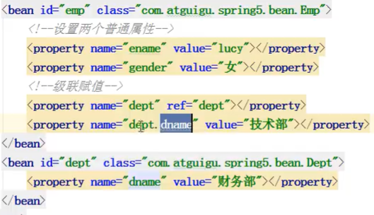
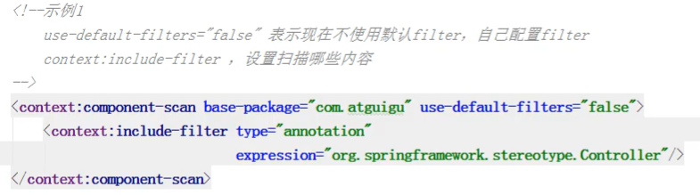
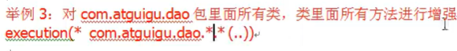
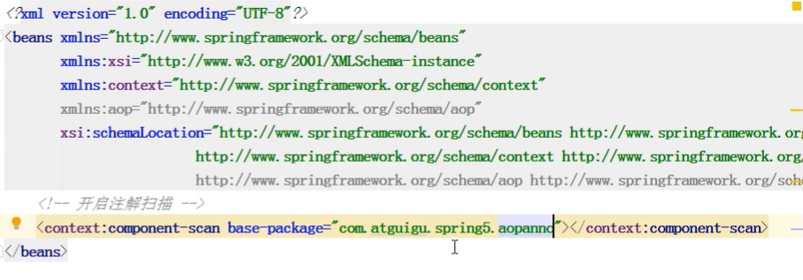
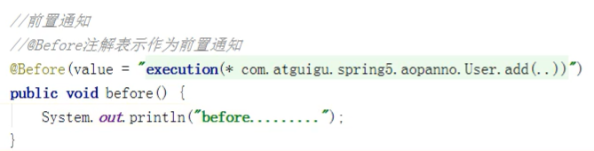
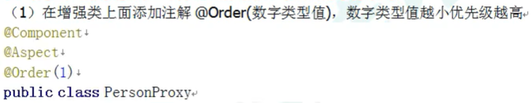

# Spring

## 1、Spring概念

### 1、Spring是轻量级的开源的JavaEE框架

### 2、Spring可以解决企业应用开发的复杂性

### 3、Spring有两个核心部分：IOC和Aop

1. IOC：控制反转，把创建对象过程交给Spring进行管理
2. Aop：面向切面，不修改源代码进行功能增强

### 4、Spring特点

1. 方便解耦，简化开发
2. Aop编程支持
3. 方便程序测试
4. 方便集成其他框架
5. 方便进行实务操作
6. 降低API开发难度

### 5、下载地址

https://repo.spring.io/release/org/springframework/spring/

## 2、IOC容器（XML中的使用）

### 1、IOC底层原理

#### 1、什么是IOC

1. 控制反转，把对象创建和对象之间的调用过程，交给Spring进行管理
2. 使用IOC目的：为了耦合度降低
3. 做入门案例就是IOC实现

#### 2、底层原理

1. xml解析、工厂模式、反射

### 2、IOC接口(BeanFactory)

1. IOC思想基于IOC容器完成，IOC容器底层就是对象工厂

2. Spring提供IOC容器实现两种方式（两个接口）

   1. BeanFactory：IOC容器基本实现，是Spring内部的使用接口，不提供开发人员进行使用

      *加载配置文件时候不会创建对象，在获取对象时才去创建

   2. ApplicationContext：BeanFactory接口的子接口，提供更多更强大的功能，一般由开发人员进行使用

      *加载配置文件时，就会把配置文件的对象创建

3. ApplicationContext接口实现类

   

### 3、IOC操作Bean管理（基于xml）

#### 1、什么是Bean管理

1. Bean管理指的是两个操作
2. Spring创建对象
3. Spring注入属性

#### 2、基于xml方式创建对象


1. 再spring配置文件中，用bean标签，标签里面添加对应属性，就可以实现对象

2. 在bean标签有很多属性，介绍常用的属性

   *id属性：唯一标识

   *class属性：类全路径（包类路径）

3. 创建对象时候，默认也是执行无参数构造方法完成对象创建（没有则报错）

#### 3、基于xml方式注入属性

1. DI：依赖注入，就是注入属性，是IOC的一种具体实现

   在spring配置文件配置对象创建，配置属性注入：

   

   *通过有参构造方法注入

   

#### 4、p名称空间注入（了解）（基于set方法注入）


#### 5、特殊的属性注入


- 2、注入属性-外部bean

1. 类的代码：


1. 对应的含有外部bean的类的实例化的xml代码：


- 3、注入属性-内部bean和级联赋值

1. 一对多关系：部门和员工

   一个部门有多个员工，一个员工属于一个部门

   部门是一，员工是多

2. 在实体类之间表示一对多关系，员工表示所属部门，使用对象类型属性表示

```java
private Dept dept;

public void setDept(Dept dept){
	this.dept = dept;
}
```

==内部bean的xml写法==


- 4、级联赋值的第二种写法：

  （必须有对应的get方法，否则dept.dname 爆红）

  

### 4、IOC操作Bean管理（FactoryBean）

1. Sping有两种类型bean，一种普通bean，另外一种工厂bean（FactoryBean）

   普通bean：在配置文件中定义bean类型就是返回类型

   工厂bean：在配置文件定义bean类型可以和返回类型不一样

==继承FactoryBean接口==


==test代码==


### 5、bean的作用域

1. 在Sping里面，设置创建bean实例是单实例还是多实例
2. 在Spring里面，默认情况下，bean是单实例对象

- 如何设置单实例还是多实例

  1. 在spring配置文件bean标签里面有属性（scope）用于设置单实例还是多实例

  2. scope属性值

     第一个值  默认值，singleton，表示实单实例对象

     第二个值 prototype，表示是多实例对象

- singleton和prototype区别

  1. singleton单实例，prototype多实例

  2. 设置scope值是singleton时候，加载spring配置文件时候就会创建对象

     设置scope值prototype时候，在调用getBean方法时候创建非单例对象

     request、session

### 6、bean的生命周期

1. 通过构造器创建bean实例（无参数构造）
2. 为bean的属性设置值和对其他bean引用（调用set方法）
3. 调用bean的初始化的方法（需要进行配置）
4. bean可以使用了（对象以及获取）
5. 当容器关闭时候，调用bean的销毁的方法（需要进行配置销毁的方法）

==实例：==


> 也可以用强转成子类，然后调用close方法

- 后置处理器的引入


==配置文件中的代码：==


> 后置处理器对xml中的所有bean都作用了


### 7、xml中属性的自动装配

- byName


- byType


### 8、外部属性文件

==德鲁伊连接池配置（druid.jar）==

- 直接配置数据库信息


- 引入外部文件


==context名称空间的引入==


==xml引入外部文件==


## 3、IOC（注解方式）

### 1、什么是注解


### 2、Spring针对Bean管理中创建对象提供注解

#### 1、@Component

#### 2、@Service

#### 3、@Controller

#### 4、@Repository

> 以上4个注解作用都是一样的，都可以用来创建bean实例

### 3、基于注解方式实现对象创建

#### 1、第一步 引入依赖


#### 2、第二步 开启组件扫描

- 引入context名称空间
- xml中开启组件扫描


- 写了注解的class


#### 3、设置只扫描包下的某个或者某些类或者包



#### 4、设置不扫描包下的某个或者某些类或者包，其余的都扫描


### 4、基于注解方式实现属性注入

#### 1、@Autowired   根据属性类型进行自动装配


#### 2、@Qualifier  根据属性名称进行注入

1. 需要和@Autowired一起使用


#### 3、@Resource  可以根据类型注入，可以根据名称注入


#### 4、@Value  注入普通类型属性


#### 5、完全注解开发


## 3、AOP

### 1、什么是AOP

1. 面向切面编程利用AOP可以对业务逻辑的各个部分进行隔离，从而使得业务逻辑各部分之间的[耦合度](https://baike.baidu.com/item/耦合度/2603938)降低，提高程序的可重用性，同时提高了开发的效率。
2. 通俗描述：不通过修改源代码方式，在主干功能里面添加新功能
3. 使用登陆例子说明AOP


### 2、AOP的底层原理

#### 1、AOP底层使用动态代理

- 有两种情况动态代理

1. 第一种  有接口情况，使用JDK动态代理


1. 第二种 没有接口情况，使用CGLIB动态代理


### 3、AOP（JDK动态代理）

#### 1、使用JDK动态代理，使用Proxy类里面的方法创建代理对象


- 调用newProxyInstance方法


1. 方法有三个参数：
   1. 第一参数：类加载器
   2. 第二参数：增强方法所在的类，这个类实现的接口。支持多个接口
   3. 第三参数：实现这个接口InvocationHandler，创建代理对象，写增强的方法

#### 2、编写JDK动态代理代码

- 创建接口，定义方法


- 创建接口实现类，实现方法


#### 3、使用Proxy类创建接口代理对象

- 总体框架：


- 将上图中的标记的对象单独拿出来


- 对应的实例使用


### 4、AOP（术语）

#### 1、连接点

1. 类里面哪些方法可以被增强，这些方法称为连接点

#### 2、切入点

1. 实际被真正增强的方法，称为切入点

#### 3、通知（增强）

1. 实际增强的逻辑部分称为通知（增强）
2. 通知有多种类型
   1. 前置通知
   2. 后置通知
   3. 环绕通知（前后都会）
   4. 异常通知
   5. 最终通知（finally）

#### 4、切面

1. 是动作
2. 把通知应用到切入点过程

### 5、AOP操作（准备）

==Spring框架一般都是基于AspectJ实现AOP操作==

#### 1、什么是AspectJ

1. AspectJ不是Spring组成部分，独立AOP框架，一般把AspectJ和Spring框架一起使用，进行AOP操作

#### 2、基于AspectJ实现AOP操作

1. 基于xml配置文件实现
2. 基于注解方式实现（使用）

#### 3、在项目工程里面引入AOP相关依赖


#### 4、切入点表达式

1. 切入点表达式作用：知道对哪个类里面的哪个方法进行增强

2. 语法结构：

   

   举例：对com.atguigu.dao.BookDao类里面的add进行增强

   

   举例：对.......类里面的所有方法进行增强

   

   

### 6、AOP操作（AspectJ注解）

#### 1、创建类，在类里面定义方法


#### 2、创建增强类（编写增强逻辑）

1. 在增强类里面，创建方法，让不同方法代表不同通知类型


#### 3、进行通知的配置

1. 在Spring配置文件中，开启注解扫描

   

2. 使用注解创建User和UserProxy对象

   

3. 在增强类上面添加注解@Aspect

   

4. 在Spring配置文件中开启生成代理对象

   

#### 4、配置不同类型的通知

1. 在增强类的里面，在作为通知方法上面添加通知类型注解，使用切入点表达式配置

   

- 其余的通知

1. @Around 环绕通知

   

2. @After 最后通知

3. @AfterThrowing 异常通知

4. @AfterReturning 返回通知、后置通知（return之后再执行）

- 执行顺序（无异常）


- 有异常


#### 5、相同切入点抽取


#### 6、有多个增强类对同一个方法进行增强。设置增强类优先级



> 数字从0开始

## 4、JdbcTemplate

## 5、事务管理

### 1、什么是事务


### 2、事务的4个特性


### 3、事务操作（Spring事务管理）

#### 1、事务添加到JavaEE三层结构中的service层

#### 2、再SPring进行事务管理操作

1. 有两种方式：编程式事务管理和声明式事务管理（使用）

#### 3、声明式事务管理

1. 基于注解方式（使用）
2. 基于xml配置文件方式

#### 4、在Spring进行声明式事务管理，底层使用AOP原理

#### 5、Spring事务管理API

1. 提供一个接口，代表事务管理器。这个接口针对不同的框架提供不同的实现类

   

### 4、注解声明式事务管理

#### 1、在Sping配置文件中配置事务管理器


#### 2、在sping配置文件，开启事务注解

1. 在spring配置文件引入tx名称空间

2. 开启事务注解

   

#### 3、在service类上面（获取service类里面方法上面）添加事务注解

1. @Transactional   这个注解添加到类上面，也可以添加方法上面
2. 如果把这个注解添加类上面，这个类里面所有的方法都添加事务
3. 如果把这个注解添加方法上面，为这个方法添加事务


### 5、事务操作（声明式事务管理参数配置）

#### 1、在service类上面添加注解@Transactional，在这个注解里面可以配置事务相关参数


#### 2、propagation：事务传播行为

1. 多事务方法直接进行调用，这个过程中事务是如何进行管理的


#### 3、isolation：事务隔离级别

1. 事务有特性称为隔离性，多事务操作之间不会产生影响。不考虑隔离性产生很多问题
2. 有三个读问题：脏读、不可重复读、虚（幻）读

- 脏读

  1. 一个未提交事务读取到另一个未提交事务的数据

     

- 不可重复读

  1. 一个未提交事务读取到另一提交事务修改数据

     

- 虚读

  1. 一个未提交事务读取到另一提交事务修改数据  类似于不可重复读

==解决方案==

1. 通过设置事务隔离级别，解决读问题

   

==实例==


#### 4、timeout：超时时间

1. 事务需要在一定时间内进行提交，如果不提交进行回滚
2. 默认值是-1（即不超时），设置时间以秒单位进行计算

#### 5、readOnly：是否只读

1. 读：查询操作，写：添加修改删除操作
2. readOnly 默认值false，表示可以查询，可以添加修改删除操作
3. 设置readOnly值是true，设置成true之后，只能查询

#### 6、rollbackFor：回滚

1. 设置出现哪些异常进行事务回滚

#### 7、noRollbackFor：不回滚

1. 设置出现哪些异常不进行事务回滚


## 6、完全注解配置

### 1、xml文件


### 2、注解方式


### 3、测试类


## 6、Spring5新特性